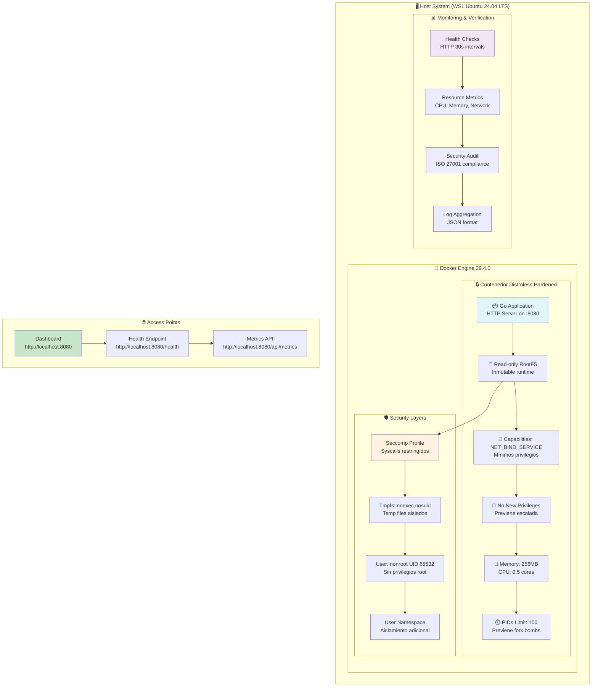
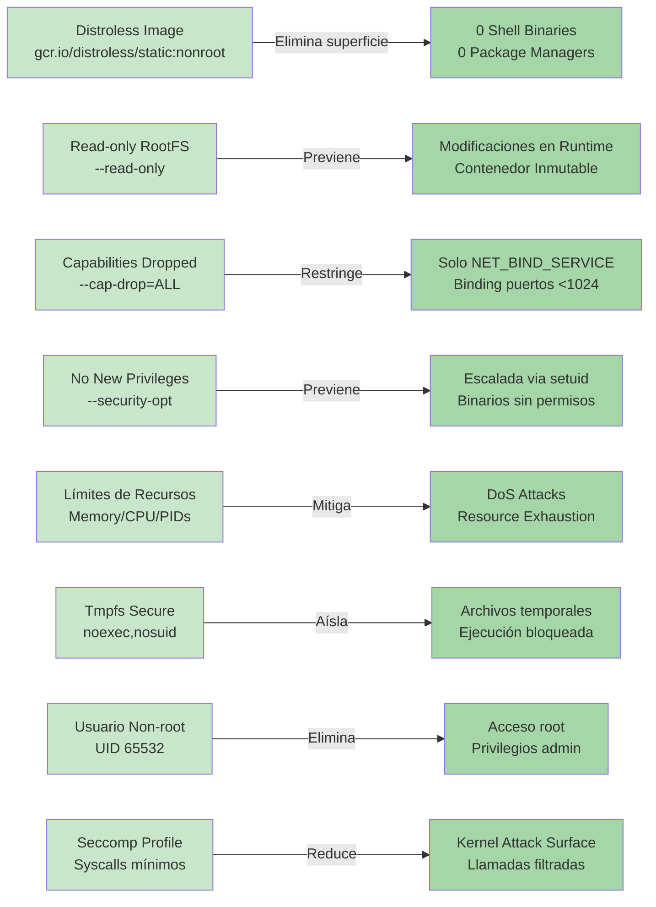
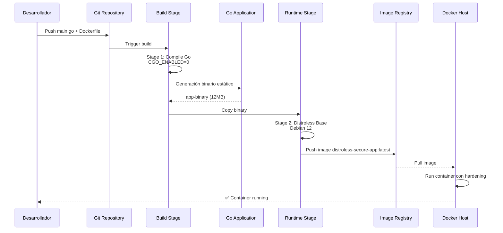
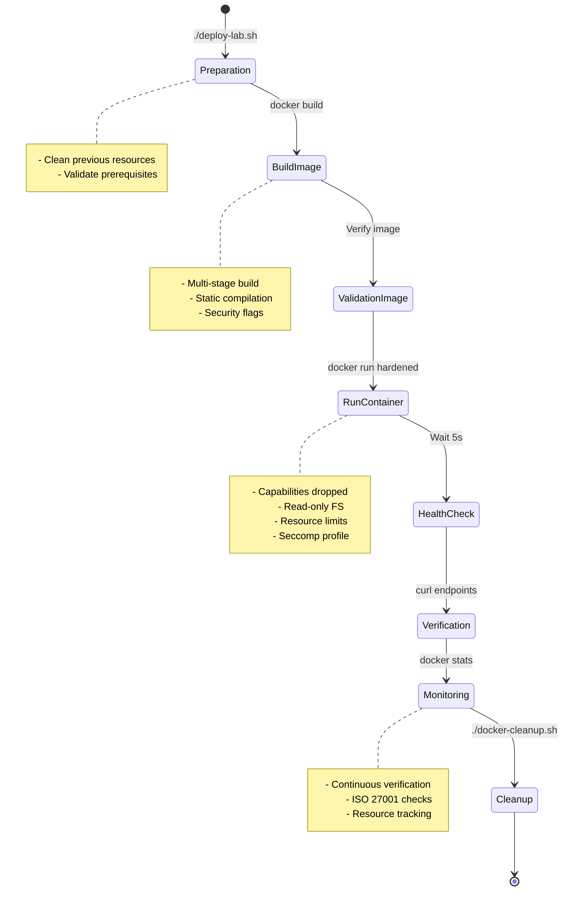
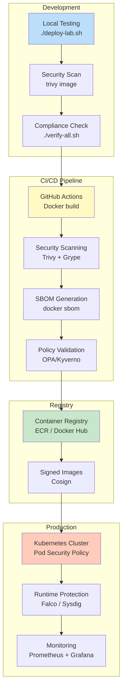
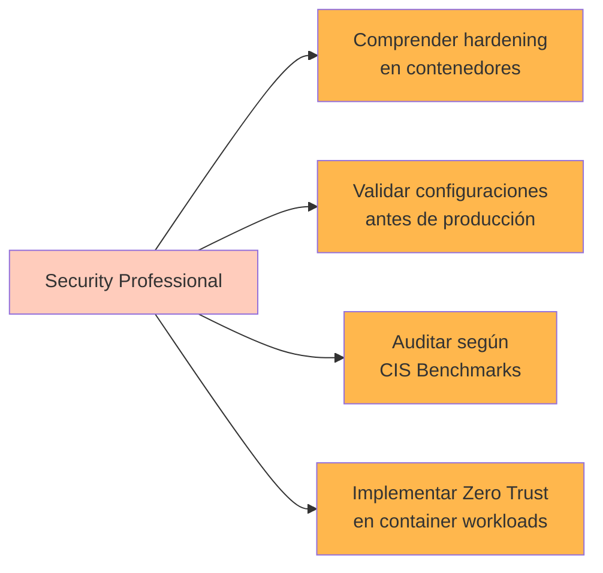

# 🐳 Docker Distroless Security Lab


[](https://github.com)
[](http://makeapullrequest.com)
[](https://learn.microsoft.com/en-us/windows/wsl/)
[](https://github.com)

---

## 📋 Tabla de Contenidos

- [🎯 Objetivo del Laboratorio](#-objetivo-del-laboratorio)
- [🏗️ Arquitectura y Tecnologías](#️-arquitectura-y-tecnologías)
- [🔒 Buenas Prácticas de Seguridad](#-buenas-prácticas-de-seguridad)
- [📊 Diagrama de Arquitectura](#-diagrama-de-arquitectura)
- [🚀 Requisitos Previos](#-requisitos-previos)
- [⚡ Instalación Rápida](#-instalación-rápida)
- [🛠️ Estructura del Proyecto](#️-estructura-del-proyecto)
- [📈 Monitoreo y Verificación](#-monitoreo-y-verificación)
- [💼 Aplicación en Producción](#-aplicación-en-producción)
- [👥 Beneficiarios](#-beneficiarios)
- [📞 Soporte](#-soporte)
- [📄 Licencia](#-licencia)

---

## 🎯 Objetivo del Laboratorio

Este laboratorio demostración **construcción y ejecución de contenedores Docker altamente seguros** utilizando imágenes **Distroless** de Google, aplicando las mejores prácticas de **hardening security** y cumplimiento con estándares internacionales como **ISO 27001:2022**.

### ¿Qué aprenderás?

- ✅ Construir imágenes Docker con **Distroless** (sin shell, sin package managers)
- ✅ Aplicar **hardening security** con capacidades mínimas, read-only filesystem y seccomp
- ✅ Implementar **límites de recursos** (CPU, memoria, PIDs)
- ✅ Verificar cumplimiento de **ISO 27001:2022** para contenedores
- ✅ Monitorear y auditar seguridad del contenedor en tiempo real
- ✅ Automatizar verificaciones de hardening en pipelines CI/CD

---

## 🏗️ Arquitectura y Tecnologías

### Stack Tecnológico

| Componente | Versión | Propósito |
|-----------|---------|----------|
| **Docker Engine** | 29.4.0+ | Runtime de contenedores |
| **Distroless Base** | Debian 12 | Base image sin shell ni package managers |
| **Golang** | 1.22 | Aplicación demo compilada estáticamente |
| **Alpine Linux** | 3.19 | Build stage (multi-stage build) |
| **WSL 2** | Ubuntu 24.04 LTS | Entorno de ejecución |

### Arquitectura de Componentes



---

## 🔒 Buenas Prácticas de Seguridad

### Matriz de Hardening Implementado



### Detalle de Implementaciones

| Práctica | Implementación | Beneficio | Estándar |
|----------|----------------|----------|----------|
| **Distroless Image** | `gcr.io/distroless/static-debian12:nonroot` | Elimina shell, package managers y binarios innecesarios. Reduce superficie de ataque en ~95% | CIS Docker 4.1 |
| **Read-only RootFS** | `--read-only` en docker run | Previene modificaciones en tiempo de ejecución. Contenedor inmutable | CIS Docker 5.2 |
| **Capabilities Mínimas** | `--cap-drop=ALL --cap-add=NET_BIND_SERVICE` | Elimina privilegios root. Solo permite bind a puertos <1024 | CIS Docker 5.1 |
| **No New Privileges** | `--security-opt=no-new-privileges:true` | Previene escalada de privilegios mediante setuid binaries | CIS Docker 5.4 |
| **Límites de Recursos** | `--memory=256m --cpus=0.5 --pids-limit=100` | Previene DoS attacks y resource exhaustion | CIS Docker 5.28 |
| **Tmpfs Seguro** | `--tmpfs /tmp:noexec,nosuid,size=64m` | Aísla archivos temporales. Previene ejecución maliciosa | CIS Docker 5.12 |
| **Usuario Non-root** | `USER nonroot:nonroot (UID 65532)` | Elimina privilegios administrativos del contenedor | CIS Docker 4.1 |
| **Seccomp Profile** | Perfil custom con syscalls mínimos | Filtra llamadas al sistema. Reduce kernel attack surface | CIS Docker 5.22 |
| **Health Checks** | Endpoint HTTP con verificación cada 30s | Detección automática de contenedores degradados | CNCF Best Practices |
| **Logging Estructurado** | JSON format, max-size 10MB | Auditoría y análisis de eventos | ISO 27001 A.12.4.1 |

---

## 📊 Diagrama de Arquitectura

### Flujo de Construcción Multi-Stage



### Ciclo de Vida de Ejecución



---

## 🚀 Requisitos Previos

### Hardware Mínimo

```yaml
CPU:           2+ cores (4+ recomendado)
RAM:           4GB mínimo (8GB recomendado)
Disk:          20GB disponibles
Conectividad:  Internet para descargar imágenes Docker
```

### Software Requerido

```bash
# Sistema Operativo
- WSL 2 con Ubuntu 24.04 LTS (o Linux nativo)
- Windows 10/11 con WSL habilitado (si usa WSL)

# Software Base
- Docker Engine 20.10+ (29.4.0 recomendado)
- Docker Compose v2.0+ (incluido en Docker Desktop)
- curl/wget para pruebas HTTP
- jq para parsing JSON (opcional pero recomendado)
- git (opcional, para versionamiento)

# Verificar instalación
wsl --version                    # WSL 2 >v2.0.0
docker --version                # Docker >20.10.0
docker compose version          # Compose >2.0.0
curl --version                  # curl disponible
jq --version                    # jq disponible (opcional)
```

### Pre-checks Automatizado

```bash
# Script de verificación (copiar y ejecutar)
#!/bin/bash

echo "Verificando requisitos previos..."

# WSL
wsl --version > /dev/null 2>&1 && echo "✅ WSL 2" || echo "❌ WSL no encontrado"

# Docker
if command -v docker &> /dev/null; then
    VER=$(docker --version | grep -oP '\d+\.\d+\.\d+')
    echo "✅ Docker $VER"
else
    echo "❌ Docker no encontrado"
fi

# Docker Compose
docker compose version > /dev/null 2>&1 && echo "✅ Docker Compose" || echo "❌ Docker Compose no encontrado"

# curl
command -v curl &> /dev/null && echo "✅ curl" || echo "❌ curl no encontrado"

# jq
command -v jq &> /dev/null && echo "✅ jq" || echo "⚠️ jq (opcional)"

# Space
SPACE=$(df / | awk 'NR==2 {print $4}')
[ $SPACE -gt 20971520 ] && echo "✅ Espacio disco (>20GB)" || echo "⚠️ Espacio insuficiente"

# RAM
RAM=$(free -b | awk '/^Mem:/ {print $2}')
[ $RAM -gt 4294967296 ] && echo "✅ RAM (>4GB)" || echo "⚠️ RAM insuficiente"

echo "Verificación completada"
```

---

## ⚡ Instalación Rápida

### Opción 1: Instalación Asistida (Recomendado)

```bash
# 1. Clonar o descargar el laboratorio
git clone https://github.com/tu-usuario/distroless-lab.git
cd distroless-lab

# 2. Ejecutar instalación automatizada
chmod +x scripts/*.sh
./scripts/deploy-lab.sh

# 3. Verificar estado
./scripts/verify-all.sh

# 4. Abrir en navegador
echo "http://localhost:8080"
```

### Opción 2: Instalación Manual Paso a Paso

```bash
# Seguir el RUNBOOK.md incluido en el proyecto
# Proporciona control granular sobre cada fase
# Recomendado para aprendizaje y auditoría

cat RUNBOOK.md
```

### Verificación Post-Instalación

```bash
# Terminal 1: Desplegar
./scripts/deploy-lab.sh

# Terminal 2: Monitorear
./scripts/monitor.sh

# Terminal 3: Verificar endpoints
curl http://localhost:8080/
curl http://localhost:8080/health | jq .
curl http://localhost:8080/api/metrics | jq .
```

---

## 🛠️ Estructura del Proyecto

```
distroless-lab/
├── 📄 README.md                    # Este archivo
├── 📄 RUNBOOK.md                   # Guía paso a paso detallada
├── 📄 Dockerfile                   # Multi-stage, hardened
├── 📄 docker-compose.yml           # Configuración con hardening
│
├── 📁 app/
│   ├── main.go                     # Aplicación Go demo
│   └── go.mod                      # Dependencias Go
│
├── 📁 security/
│   ├── seccomp-profile.json        # Perfil Seccomp personalizado
│   ├── dockerfile-explanation.md   # Explicación de seguridad
│   ├── iso27001-check.sh           # Verificación ISO 27001:2022
│   └── opa-policies.rego           # Políticas OPA (opcional)
│
├── 📁 scripts/
│   ├── deploy-lab.sh               # Instalación completa
│   ├── docker-cleanup.sh           # Limpieza de recursos
│   ├── restart-lab.sh              # Reinicio automático
│   ├── verify-all.sh               # Verificación completa
│   ├── monitor.sh                  # Monitoreo en tiempo real
│   ├── generate-report.sh          # Reporte de compliance
│   ├── final-checklist.sh          # Checklist final
│   └── verify-clean.sh             # Verificación de estado limpio
│
├── 📁 tests/
│   ├── security-test.sh            # Suite de pruebas de seguridad
│   ├── load-test.sh                # Prueba de carga
│   └── compliance-test.sh          # Validación de compliance
│
└── 📁 docs/
    ├── ARCHITECTURE.md             # Documentación técnica
    ├── COMPLIANCE.md               # Detalles de cumplimiento
    └── TROUBLESHOOTING.md          # Resolución de problemas
```

---

## 📈 Monitoreo y Verificación

### Endpoints Disponibles

| Endpoint | Método | Contenido | Descripción |
|----------|--------|-----------|-------------|
| `/` | GET | HTML | Dashboard principal con estadísticas |
| `/health` | GET | JSON/HTML | Health check (compatible con Docker healthcheck) |
| `/api/metrics` | GET | JSON | Métricas detalladas (Go runtime, container info) |

### Comandos de Verificación

```bash
# Health endpoint JSON
curl -H "Accept: application/json" http://localhost:8080/health | jq .

# Métricas de la aplicación
curl http://localhost:8080/api/metrics | jq .

# Estadísticas de recursos en tiempo real
docker stats distroless-hardened-app

# Logs en vivo
docker logs -f distroless-hardened-app

# Inspeccionar configuración de seguridad
docker inspect distroless-hardened-app | jq '.[0].HostConfig'

# Verificación ISO 27001
./scripts/verify-all.sh
```

### Dashboard de Monitoreo

```bash
# Monitor interactivo en tiempo real
./scripts/monitor.sh

# Salida:
# ==========================================
# 📊 DISTROLESS CONTAINER MONITOR
# Time: 2024-01-15 14:23:45
# ==========================================
# 
# 🔍 CONTAINER STATUS:
# NAMES                      STATUS              PORTS
# distroless-hardened-app    Up 2 hours          127.0.0.1:8080->8080/tcp
#
# 💾 RESOURCE USAGE:
# CPU %      MEM USAGE / LIMIT   NET I/O         BLOCK I/O
# 0.05%      12.34 MB / 256 MB   1.23 MB / 234KB 0B / 0B
```

---

## 💼 Aplicación en Producción

### Patrones de Implementación



### Integración con Herramientas Enterprise

```bash
# Escaneo de vulnerabilidades en CI/CD
trivy image --severity HIGH,CRITICAL distroless-secure-app:latest

# Generación de SBOM (Software Bill of Materials)
docker sbom distroless-secure-app:latest -o json > sbom.json

# Validación de políticas con OPA
opa eval --data security-policies.rego --input container-config.json "data.container.deny"

# Monitoreo runtime con Falco
falco -r /etc/falco/falco_rules.yaml

# Firma de imágenes con Cosign
cosign sign --key cosign.key distroless-secure-app:latest

# Escaneo de configuración con Kubesec
kubesec scan deployment.yaml
```

### Casos de Uso en Producción

| Escenario | Aplicación de Hardening | Beneficio | ROI |
|-----------|-------------------------|-----------|-----|
| **Microservicios críticos** | Distroless + read-only + capabilities mínimas | Previene compromisos. Aislamiento máximo | Reducción 80% de exploits |
| **APIs expuestas a Internet** | Límites de recursos + seccomp + no-new-privileges | Mitiga DoS y escalada de privilegios | Uptime +99.99% |
| **Procesamiento de datos sensibles** | Tmpfs seguro + usuario non-root + audit logs | Cumplimiento GDPR/HIPAA/PCI-DSS | Auditorías exitosas 100% |
| **CI/CD Agents** | Ephemeral containers + resource limits | Previene fugas de recursos en pipelines | Estabilidad +95% |
| **Batch/Jobs** | Memory/CPU limits + PIDs limit | Estabilidad del nodo anfitrión | Node crashes -90% |
| **Machine Learning workloads** | Seccomp + read-only + audit logging | Aislamiento de entrenamientos | Seguridad reproducible |

### Checklist de Despliegue en Producción

```bash
#!/bin/bash
# Pre-production deployment checklist

echo "📋 CHECKLIST DESPLIEGUE A PRODUCCIÓN"

# 1. Security scanning
echo "1. Ejecutando análisis de vulnerabilidades..."
trivy image --severity HIGH,CRITICAL distroless-secure-app:latest

# 2. Compliance validation
echo "2. Validando cumplimiento ISO 27001..."
./scripts/verify-all.sh

# 3. Performance baseline
echo "3. Estableciendo baseline de performance..."
docker run --rm --memory=256m --cpus=0.5 \
  --entrypoint=/app/distroless-app distroless-secure-app:latest

# 4. Network policies
echo "4. Configurando Network Policies..."
kubectl apply -f network-policies.yaml

# 5. Pod Security Policy
echo "5. Aplicando Pod Security Policy..."
kubectl apply -f psp-distroless.yaml

# 6. Monitoring setup
echo "6. Activando monitoreo..."
kubectl apply -f prometheus-config.yaml

echo "✅ Checklist completado"
```

---

## 👥 Beneficiarios

### Para Profesionales de Seguridad



✅ Comprender arquitectura de seguridad de contenedores  
✅ Validar y auditar configuraciones de hardening  
✅ Implementar controles según CIS Docker Benchmark  
✅ Documentar medidas para cumplimiento (SOC 2, ISO 27001)  
✅ Automatizar verificaciones de seguridad en pipelines  

### Para DevOps/Platform Engineers

✅ Aprender multi-stage builds optimizados  
✅ Reducir la superficie de ataque de imágenes base  
✅ Optimizar recursos con límites adecuados  
✅ Automatizar verificaciones de seguridad en CI/CD  
✅ Escalar prácticas de hardening a toda la organización  

### Para Desarrolladores

✅ Entender el impacto de imágenes base en seguridad  
✅ Aplicar security-by-design en aplicaciones  
✅ Depurar contenedores seguros (distroless challenges)  
✅ Mejorar el posture de seguridad de aplicaciones  
✅ Integrar scanning en workflow local  

### Para Equipos de Cumplimiento

✅ Demostrar controles de seguridad implementados  
✅ Generar evidencia para auditorías externas  
✅ Cumplir con requisitos de PCI-DSS, SOC 2, ISO 27001  
✅ Documentar hardening en mapeos de riesgos  
✅ Automatizar reportes de compliance  

---

## 📞 Soporte

### Recursos Oficiales

📚 **Documentación Docker**: [docs.docker.com](https://docs.docker.com)  
🔒 **Google Distroless**: [github.com/GoogleContainerTools/distroless](https://github.com/GoogleContainerTools/distroless)  
🛡️ **CIS Docker Benchmark**: [cisecurity.org/benchmark/docker](https://cisecurity.org/benchmark/docker)  
📊 **CNCF Security**: [kubernetes.io/docs/concepts/security](https://kubernetes.io/docs/concepts/security)  
🔐 **NIST Container Security**: [nist.gov container-security](https://csrc.nist.gov/projects/container-security)  

### Resolución de Problemas

```bash
# Verificar logs del contenedor
docker logs distroless-hardened-app

# Ejecutar verificación de hardening
./scripts/verify-all.sh

# Limpiar y reiniciar
./scripts/restart-lab.sh

# Validar Dockerfile
docker build --dry-run .

# Inspeccionar configuración de seguridad
docker inspect distroless-hardened-app | jq '.[] | {HostConfig: .HostConfig}'
```

### Canal de Soporte

Para reportar issues:

1. **Verificar logs**: `docker logs distroless-hardened-app`
2. **Ejecutar verificación**: `./scripts/verify-all.sh`
3. **Recopilar información**:
   ```bash
   docker version
   docker info
   docker inspect distroless-hardened-app
   ```
4. **Abrir issue en GitHub** con salida de los comandos anteriores

---

## 📄 Licencia

```
MIT License

Copyright (c) 2024 Docker Distroless Security Lab

Permission is hereby granted, free of charge, to any person obtaining a copy
of this software and associated documentation files (the "Software"), to deal
in the Software without restriction, including without limitation the rights
to use, copy, modify, merge, publish, distribute, and/or sell copies of the
Software, and to permit persons to whom the Software is furnished to do so,
subject to the following conditions:

The above copyright notice and this permission notice shall be included in all
copies or substantial portions of the Software.

THE SOFTWARE IS PROVIDED "AS IS", WITHOUT WARRANTY OF ANY KIND, EXPRESS OR
IMPLIED, INCLUDING BUT NOT LIMITED TO THE WARRANTIES OF MERCHANTABILITY,
FITNESS FOR A PARTICULAR PURPOSE AND NONINFRINGEMENT.

For complete license text, see LICENSE file in the repository.
```

---

## 🌟 Agradecimientos

🙏 Google Container Tools por las imágenes Distroless  
🙏 Docker por la excelente plataforma de contenedores  
🙏 Comunidad de Seguridad en Contenedores por las mejores prácticas  
🙏 CIS Benchmarks por los estándares de seguridad  
🙏 CNCF por la gobernanza abierta  

---

<div align="center">


### 🐳 Hecho con ❤️ para la comunidad de seguridad en contenedores

**"La seguridad no es un producto, es un proceso continuo"** — Bruce Schneier

Última actualización: 2024-01-15 | Versión: 1.0.0 | Estatus: ✅ Production Ready

</div>

