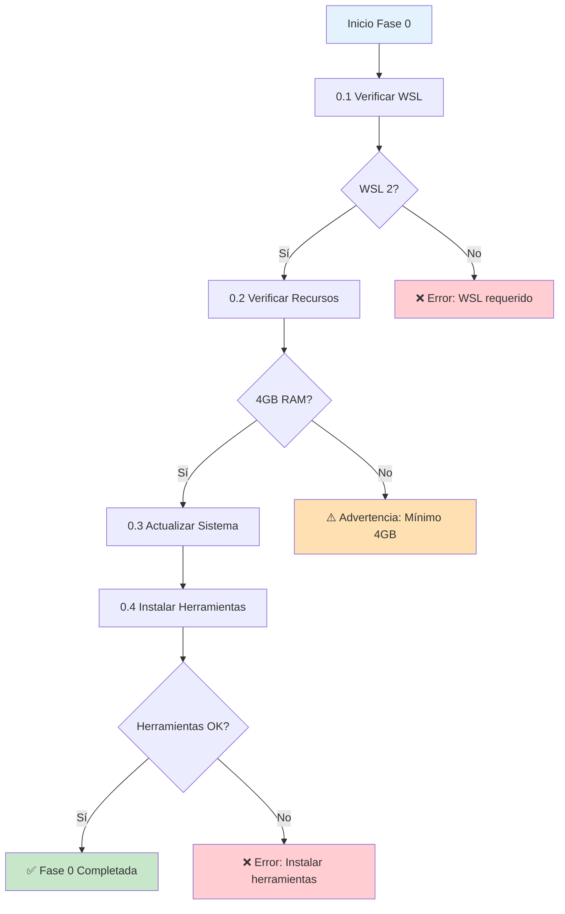
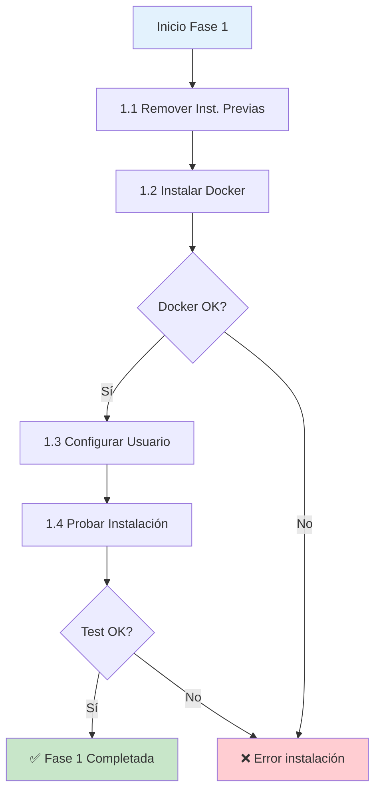
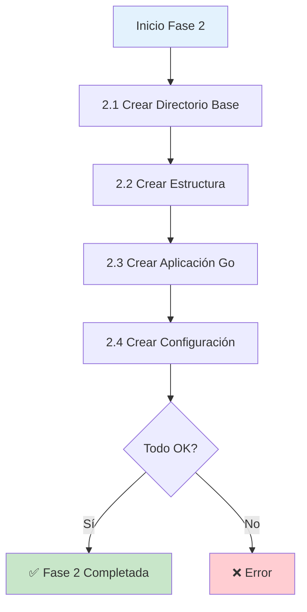
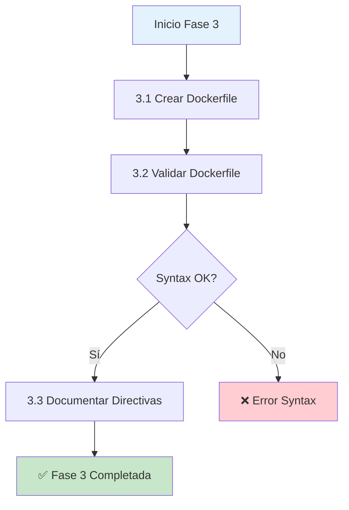
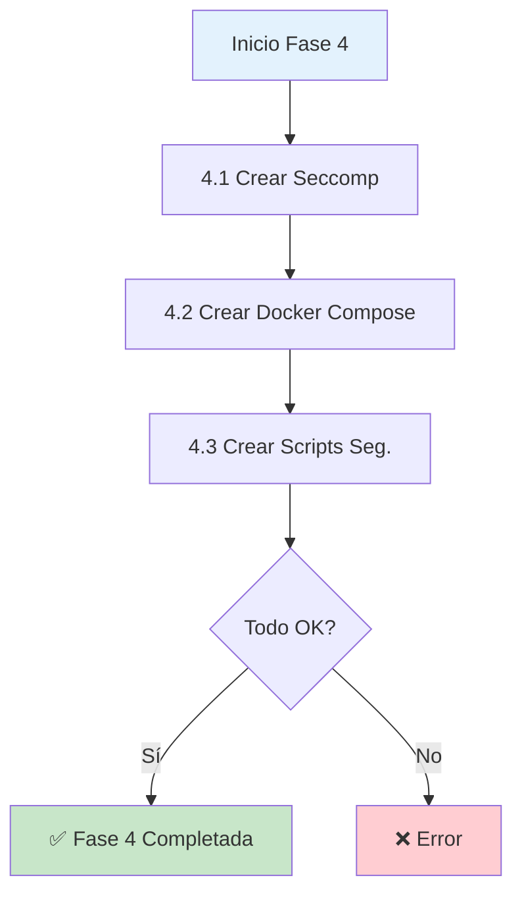
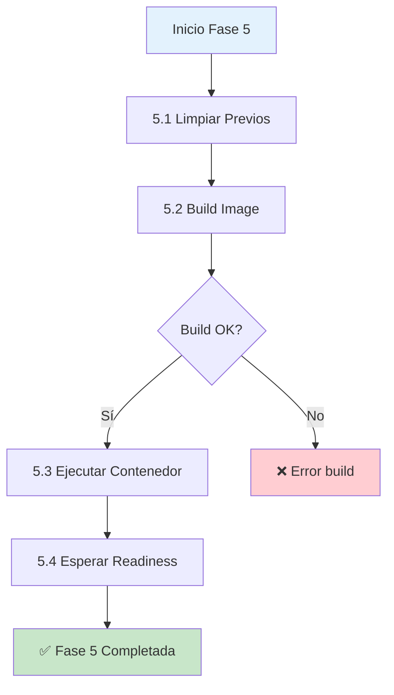
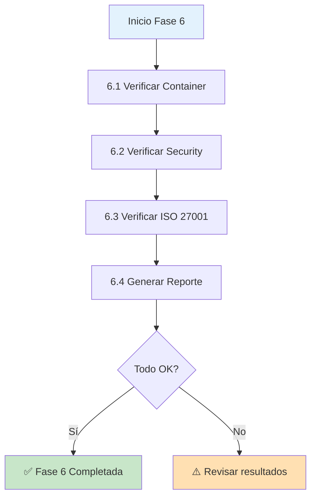

# 📋 Runbook Quirúrgico: Docker Distroless Security Lab


---

## 📑 Índice de Fases

```mermaid
flowchart LR
    Start(["🚀 Inicio"]) --> F0["Fase 0<br/>Preparación"]
    F0 --> F1["Fase 1<br/>Docker Install"]
    F1 --> F2["Fase 2<br/>Estructura"]
    F2 --> F3["Fase 3<br/>Dockerfile"]
    F3 --> F4["Fase 4<br/>Seguridad"]
    F4 --> F5["Fase 5<br/>Build Deploy"]
    F5 --> F6["Fase 6<br/>Verificación"]
    F6 --> F7["Fase 7<br/>Monitoreo"]
    F7 --> F8["Fase 8<br/>Cleanup"]
    F8 --> End(["✅ Ready para Repetir"])
    
    style Start fill:#c8e6c9
    style F0 fill:#bbdefb
    style F1 fill:#bbdefb
    style F2 fill:#bbdefb
    style F3 fill:#fff9c4
    style F4 fill:#fff9c4
    style F5 fill:#ffccbc
    style F6 fill:#c8e6c9
    style F7 fill:#c8e6c9
    style F8 fill:#ffccbc
    style End fill:#c8e6c9
```



---

## 🔴 FASE 0: Preparación del Ambiente

### Objetivo: Validar recursos y preparar sistema



### Paso 0.1: Verificar WSL y Sistema

**¿Qué hace?** Valida que WSL 2 esté habilitado y que el sistema sea compatible.

```bash
#!/bin/bash

# ============================================
# PASO 0.1: VERIFICACIÓN DE WSL Y SISTEMA (v2.0)
# ============================================

# Colores para mejor legibilidad
GREEN='\033[0;32m'
RED='\033[0;31m'
YELLOW='\033[1;33m'
NC='\033[0m' # No Color

echo -e "${GREEN}=== PASO 0.1: Verificación de WSL y Sistema ===${NC}"

# 1. Verificar si estamos en WSL (Detección interna y externa)
echo -n "1. Verificando entorno WSL 2... "
IS_WSL=false
if grep -qi "microsoft" /proc/version; then
    IS_WSL=true
    KERNEL_VER=$(uname -r)
    echo -e "${GREEN}✅ Detectado (Kernel: $KERNEL_VER)${NC}"
elif command -v wsl.exe > /dev/null 2>&1; then
    IS_WSL=true
    echo -e "${GREEN}✅ WSL detectado vía interoperabilidad${NC}"
else
    echo -e "${RED}❌ No se detecta entorno WSL${NC}"
    echo "⚠️  Este script debe ejecutarse dentro de Ubuntu en WSL."
    echo "Sugerencia: Ejecuta 'wsl' en tu PowerShell antes de lanzar el script."
    exit 1
fi

# 2. Verificar distribución de Linux
echo -n "2. Verificando distribución... "
if [ -f /etc/os-release ]; then
    . /etc/os-release
    if [[ "$ID" == "ubuntu" ]]; then
        echo -e "${GREEN}✅ $PRETTY_NAME${NC}"
    else
        echo -e "${YELLOW}⚠️ $PRETTY_NAME (Se recomienda Ubuntu para este lab)${NC}"
    fi
else
    echo -e "${RED}❌ No se pudo identificar la distribución${NC}"
fi

# 3. Verificar recursos del sistema
echo -e "\n${GREEN}=== RECURSOS DEL SISTEMA ===${NC}"

# CPU
CORES=$(nproc)
echo -n "CPU Cores: $CORES "
if [ "$CORES" -ge 2 ]; then
    echo -e "${GREEN}✅ (Mín: 2, OK)${NC}"
else
    echo -e "${YELLOW}⚠️ (Mín: 2, Rendimiento bajo)${NC}"
fi

# RAM
RAM_TOTAL_GB=$(free -g | awk '/^Mem:/ {print $2}')
# Si free -g da 0 (menos de 1GB), usamos MB
if [ "$RAM_TOTAL_GB" -eq 0 ]; then
    RAM_TOTAL_GB=$(free -m | awk '/^Mem:/ {print int($2/1024)}')
fi

echo -n "RAM Total: ${RAM_TOTAL_GB}GB "
if [ "$RAM_TOTAL_GB" -ge 4 ]; then
    echo -e "${GREEN}✅ (Mín: 4GB, OK)${NC}"
else
    echo -e "${YELLOW}⚠️ (Mín: 4GB, El lab será lento)${NC}"
fi

# DISCO (Idempotencia: verificamos espacio disponible sin escribir nada)
DISK_FREE_GB=$(df -BG / | awk 'NR==2 {print $4}' | sed 's/G//')
echo -n "Espacio en Disco: ${DISK_FREE_GB}GB disponibles "
if [ "$DISK_FREE_GB" -ge 20 ]; then
    echo -e "${GREEN}✅ (Mín: 20GB, OK)${NC}"
else
    echo -e "${RED}❌ (Insuficiente)${NC}"
    exit 1
fi

# 4. Verificar conectividad (Idempotente por naturaleza)
echo -n -e "\n5. Verificando Internet... "
if curl -s --connect-timeout 3 google.com > /dev/null; then
    echo -e "${GREEN}✅ Conectividad OK${NC}"
else
    echo -e "${RED}❌ Sin conexión (Requerida para instalar herramientas)${NC}"
    exit 1
fi

echo -e "\n${GREEN}✅ PASO 0.1 COMPLETADO CORRECTAMENTE${NC}"
```

**Salida esperada:**
```
=== PASO 0.1: Verificación de WSL y Sistema ===
1. Verificando WSL 2... ✅ WSL version: 2.0.0
2. Verificando distribución... ✅ Ubuntu 24.04 LTS
3. Verificando kernel... ✅ WSL Kernel: 5.15.91.25-generic-WSL
4. CPU Cores: 4 (Mín: 2, Óptimo: 4+)
   ✅ Cores suficientes
...
✅ PASO 0.1 COMPLETADO
```

---

### Paso 0.2: Actualizar Sistema Base

**¿Qué hace?** Actualiza paquetes y repositorios del sistema operativo. Asegura que tengas las últimas actualizaciones de seguridad.

```bash
#!/bin/bash
# ============================================
# PASO 0.2: ACTUALIZAR SISTEMA BASE
# ============================================

echo "=== PASO 0.2: Actualizar Sistema Base ==="

# 1. Actualizar lista de repositorios
echo "1. Actualizando repositorios..."
sudo apt update

# Salida esperada:
# Hit:1 http://security.ubuntu.com/ubuntu jammy-security InRelease
# Get:2 http://archive.ubuntu.com/ubuntu jammy InRelease
# Reading package lists... Done

# 2. Actualizar paquetes existentes
echo "2. Actualizando paquetes existentes..."
sudo apt upgrade -y

# Salida esperada: "0 upgraded, 0 newly installed..."

# 3. Instalar actualizaciones de seguridad automáticas
echo "3. Configurando actualizaciones automáticas..."
sudo apt install -y unattended-upgrades

# 4. Limpiar paquetes obsoletos
echo "4. Limpiando paquetes obsoletos..."
sudo apt autoremove -y
sudo apt autoclean -y

# 5. Verificar si hay actualizaciones pendientes
echo ""
echo "5. Verificando estado final..."
UPDATES=$(apt list --upgradable 2>/dev/null | wc -l)
if [ $UPDATES -le 1 ]; then
    echo "✅ Sistema completamente actualizado"
else
    echo "⚠️ Aún hay $((UPDATES-1)) paquetes por actualizar"
fi

echo ""
echo "✅ PASO 0.2 COMPLETADO"
```

---

### Paso 0.3: Instalar Herramientas Base

**¿Qué hace?** Instala herramientas esenciales necesarias para el laboratorio (curl, jq, git, etc.).

```bash
#!/bin/bash
# ============================================
# PASO 0.3: INSTALAR HERRAMIENTAS BASE (Mejorado)
# ============================================

set -e # Salir si hay errores críticos

echo -e "\e[32m=== PASO 0.3: Instalar Herramientas Base ===\e[0m"

# Lista de paquetes a instalar
PACKAGES=(curl wget git jq tree net-tools htop ca-certificates gnupg lsb-release)

echo "Actualizando índices de paquetes..."
sudo apt update -qq

echo "Instalando paquetes: ${PACKAGES[*]}"
sudo apt install -y "${PACKAGES[@]}"

echo -e "\n=== VERIFICACIÓN DE HERRAMIENTAS ==="

# Función para verificar con lógica personalizada
verify_tool() {
    local tool=$1
    local check_cmd=$2
    
    if command -v "$check_cmd" &> /dev/null; then
        echo -e "✅ $tool: Instalado correctamente"
    else
        # Si no es un comando, verificamos si el paquete está en la base de datos de dpkg
        if dpkg -l | grep -qw "$tool"; then
            echo -e "✅ $tool: Paquete presente (Librería/Fondo)"
        else
            echo -e "❌ $tool: ERROR DE INSTALACIÓN"
        fi
    fi
}

# Verificaciones específicas
# tool_name binario_a_probar
verify_tool "curl" "curl"
verify_tool "wget" "wget"
verify_tool "git" "git"
verify_tool "jq" "jq"
verify_tool "tree" "tree"
verify_tool "net-tools" "ifconfig"  # net-tools provee ifconfig
verify_tool "htop" "htop"
verify_tool "ca-certificates" "update-ca-certificates" # comando de gestión
verify_tool "gnupg" "gpg"            # el binario es gpg
verify_tool "lsb-release" "lsb_release" # el binario tiene guion bajo

echo -e "\n\e[32m✅ PASO 0.3 COMPLETADO\e[0m"
```

---

## 🔵 FASE 1: Instalación y Configuración de Docker

### Objetivo: Instalar Docker Engine 29.4.0+ desde repositorio oficial



### Paso 1.1: Remover Instalaciones Previas

**¿Qué hace?** Elimina versiones antigas de Docker que puedan causar conflictos. Importante para evitar incompatibilidades.

```bash
#!/bin/bash
# ============================================
# PASO 1.1: REMOVER INSTALACIONES PREVIAS
# ============================================

echo "=== PASO 1.1: Remover Instalaciones Previas ==="

# Desinstalar paquetes antiguos (si existen)
echo "1. Removiendo versiones antigas de Docker..."
sudo apt remove -y \
    docker \
    docker-engine \
    docker.io \
    containerd \
    runc 2>/dev/null || true

# Limpiar configuraciones residuales
echo "2. Limpiando configuraciones residuales..."
sudo rm -rf /var/lib/docker/ 2>/dev/null || true
sudo rm -rf /var/lib/containerd/ 2>/dev/null || true
sudo rm -rf /var/run/docker.sock 2>/dev/null || true

# Remover grupo docker si existe
sudo delgroup docker 2>/dev/null || true

echo "✅ Instalaciones previas removidas"
echo ""
echo "✅ PASO 1.1 COMPLETADO"
```

---

### Paso 1.2: Instalar Docker desde Repositorio Oficial

**¿Qué hace?** Descarga e instala Docker Engine 29.4.0+ desde los repositorios oficiales con validación de GPG.

```bash
#!/bin/bash
# ============================================
# PASO 1.2: INSTALAR DOCKER
# ============================================

echo "=== PASO 1.2: Instalar Docker desde Repositorio Oficial ==="

# 1. Crear directorio para claves
echo "1. Configurando clave GPG..."
sudo mkdir -p /etc/apt/keyrings

# 2. Descargar y agregar clave GPG oficial de Docker
echo "2. Descargando clave GPG de Docker..."
curl -fsSL https://download.docker.com/linux/ubuntu/gpg | \
    sudo gpg --dearmor -o /etc/apt/keyrings/docker.gpg

# Verificar que la clave se agregó
if [ -f /etc/apt/keyrings/docker.gpg ]; then
    echo "✅ Clave GPG instalada"
else
    echo "❌ Error: No se pudo descargar clave GPG"
    exit 1
fi

# 3. Configurar el repositorio
echo "3. Configurando repositorio Docker..."
echo \
  "deb [arch=$(dpkg --print-architecture) signed-by=/etc/apt/keyrings/docker.gpg] \
  https://download.docker.com/linux/ubuntu \
  $(lsb_release -cs) stable" | sudo tee /etc/apt/sources.list.d/docker.list > /dev/null

# 4. Actualizar índice de paquetes
echo "4. Actualizando índice de paquetes..."
sudo apt update

# 5. Instalar Docker Engine, CLI y complementos
echo "5. Instalando Docker Engine y complementos..."
sudo apt install -y \
    docker-ce \
    docker-ce-cli \
    containerd.io \
    docker-buildx-plugin \
    docker-compose-plugin

echo ""
echo "6. Verificando versiones instaladas..."
docker --version
docker compose version

echo ""
echo "✅ PASO 1.2 COMPLETADO"
```

**Salida esperada:**
```
1. Configurando clave GPG...
2. Descargando clave GPG de Docker...
✅ Clave GPG instalada
3. Configurando repositorio Docker...
4. Actualizando índice de paquetes...
5. Instalando Docker Engine y complementos...
  ...instalación exitosa...
6. Verificando versiones instaladas...
Docker version 29.4.0, build 9d7ad9f
Docker Compose version v2.29.0

✅ PASO 1.2 COMPLETADO
```

---

### Paso 1.3: Configurar Usuario y Permisos

**¿Qué hace?** Agrega tu usuario al grupo docker para no necesitar `sudo` cada vez. **IMPORTANTE**: Cierra sesión después.

```bash
#!/bin/bash
# ============================================
# PASO 1.3: CONFIGURAR USUARIO Y PERMISOS
# ============================================

echo "=== PASO 1.3: Configurar Usuario y Permisos ==="

# 1. Crear grupo docker si no existe
echo "1. Creando grupo docker..."
sudo groupadd docker 2>/dev/null || true

# 2. Agregar usuario actual al grupo
echo "2. Agregando usuario al grupo docker..."
sudo usermod -aG docker $USER

# 3. Verificar
echo "3. Verificando membresía..."
if groups $USER | grep -q docker; then
    echo "✅ Usuario agregado al grupo docker"
else
    echo "⚠️ Usuario NO agregado aún (requiere logout/login)"
fi

# 4. Habilitar Docker al inicio
echo "4. Habilitando Docker al inicio del sistema..."
sudo systemctl daemon-reload
sudo systemctl enable docker
sudo systemctl start docker

# 5. Verificar estado
echo "5. Verificando estado del servicio..."
if sudo systemctl is-active --quiet docker; then
    echo "✅ Docker servicio activo"
else
    echo "❌ Docker servicio NO activo"
    exit 1
fi

echo ""
echo "⚠️  IMPORTANTE: Debes CERRAR SESIÓN y VOLVER A ENTRAR"
echo "    para que los cambios de permisos tengan efecto."
echo ""
echo "Alternativa temporal: ejecuta: newgrp docker"
echo ""
echo "✅ PASO 1.3 COMPLETADO"
```

---

### Paso 1.4: Probar Instalación de Docker

**¿Qué hace?** Ejecuta test básico para confirmar que Docker funciona correctamente.

```bash
#!/bin/bash
# ============================================
# PASO 1.4: PROBAR INSTALACIÓN
# ============================================

echo "=== PASO 1.4: Probar Instalación de Docker ==="

# 1. Test hello-world
echo "1. Ejecutando hello-world..."
if docker run --rm hello-world > /dev/null 2>&1; then
    echo "✅ Test hello-world exitoso"
else
    echo "❌ Test hello-world falló"
    echo "⚠️  Si obtuviste error de permisos, ejecuta: newgrp docker"
    exit 1
fi

# 2. Verificar información del sistema
echo ""
echo "2. Información del sistema Docker..."
docker info --format='
CPU Count: {{.NCPU}}
Memory: {{.MemTotal | printf "%.0f"}}MB
Storage Driver: {{.Driver}}
Kernel Version: {{.KernelVersion}}
Operating System: {{.OperatingSystem}}
'

# 3. Verificar opciones de seguridad
echo ""
echo "3. Verificando opciones de seguridad..."
docker info | grep -A 2 "Security Options"

# 4. Listar imágenes descargadas
echo ""
echo "4. Imágenes descargadas:"
docker images --format "table {{.Repository}}\t{{.Tag}}\t{{.Size}}"

echo ""
echo "✅ PASO 1.4 COMPLETADO"
```

**Salida esperada:**
```
1. Ejecutando hello-world...
✅ Test hello-world exitoso

2. Información del sistema Docker...

CPU Count: 4
Memory: 8192MB
Storage Driver: overlay2
Kernel Version: 5.15.91.25-generic-WSL
Operating System: Docker Desktop
 
3. Verificando opciones de seguridad...
Security Options: apparmor seccomp

4. Imágenes descargadas:
REPOSITORY   TAG       SIZE
hello-world  latest    13.3kB

✅ PASO 1.4 COMPLETADO
```

---

## 🟡 FASE 2: Estructura del Proyecto

### Objetivo: Crear directorios y archivos necesarios



### Paso 2.1: Crear Directorio Base

**¿Qué hace?** Crea la estructura de directorios del laboratorio.

```bash
#!/bin/bash
# ============================================
# PASO 2.1: CREAR ESTRUCTURA DE DIRECTORIOS
# ============================================

echo "=== PASO 2.1: Crear Estructura de Directorios ==="

# Crear directorio base
BASE_DIR="$HOME/distroless-lab"
echo "1. Creando directorio base: $BASE_DIR"
mkdir -p $BASE_DIR

# Crear subdirectorios
echo "2. Creando subdirectorios..."
mkdir -p $BASE_DIR/{app,security,scripts,tests,docs}

# Cambiar a directorio
cd $BASE_DIR
echo "3. Directorio actual: $(pwd)"

# Mostrar estructura
echo ""
echo "4. Estructura creada:"
tree -L 2 -a 2>/dev/null || find . -maxdepth 2 -type d | sort

echo ""
echo "✅ PASO 2.1 COMPLETADO"
```

---

### Paso 2.2: Crear Aplicación Go (main.go)

**¿Qué hace?** Crea la aplicación Go que será ejecutada en el contenedor. Incluye endpoints `/`, `/health` y `/api/metrics`.

```bash
#!/bin/bash
# ============================================
# PASO 2.2: CREAR APLICACIÓN GO
# ============================================

echo "=== PASO 2.2: Crear Aplicación Go ==="

cd $HOME/distroless-lab

# Crear main.go
echo "1. Creando main.go..."
cat > app/main.go << 'EOF'
package main

import (
    "encoding/json"
    "fmt"
    "log"
    "net/http"
    "os"
    "runtime"
    "time"
)

type HealthResponse struct {
    Status    string    `json:"status"`
    Timestamp time.Time `json:"timestamp"`
    Container string    `json:"container_id"`
    Uptime    string    `json:"uptime"`
}

type MetricsResponse struct {
    GoVersion   string `json:"go_version"`
    NumCPU      int    `json:"num_cpu"`
    NumGoroutines int `json:"num_goroutines"`
    ContainerID string `json:"container_id"`
    MemoryUsage string `json:"memory_usage_mb"`
}

var startTime time.Time

func init() {
    startTime = time.Now()
}

func main() {
    hostname, _ := os.Hostname()

    // Health endpoint - HTML y JSON
    http.HandleFunc("/health", func(w http.ResponseWriter, r *http.Request) {
        accept := r.Header.Get("Accept")
        
        response := HealthResponse{
            Status:    "healthy",
            Timestamp: time.Now(),
            Container: hostname,
            Uptime:    time.Since(startTime).String(),
        }
        
        if accept == "application/json" {
            w.Header().Set("Content-Type", "application/json")
            json.NewEncoder(w).Encode(response)
        } else {
            w.Header().Set("Content-Type", "text/html")
            html := fmt.Sprintf(`<!DOCTYPE html>
            <html><head><title>Health Check</title></head>
            <body>
                <h1>✅ Container Health</h1>
                <p>Status: %s</p>
                <p>Container: %s</p>
                <p>Uptime: %s</p>
                <p><a href="/">Home</a></p>
            </body></html>`,
                response.Status, response.Container, response.Uptime)
            w.Write([]byte(html))
        }
    })

    // Metrics endpoint
    http.HandleFunc("/api/metrics", func(w http.ResponseWriter, r *http.Request) {
        var m runtime.MemStats
        runtime.ReadMemStats(&m)
        
        metrics := MetricsResponse{
            GoVersion:     runtime.Version(),
            NumCPU:        runtime.NumCPU(),
            NumGoroutines: runtime.NumGoroutine(),
            ContainerID:   hostname,
            MemoryUsage:   fmt.Sprintf("%.2f MB", float64(m.Alloc)/1024/1024),
        }
        
        w.Header().Set("Content-Type", "application/json")
        json.NewEncoder(w).Encode(metrics)
    })

    // Dashboard principal
    http.HandleFunc("/", func(w http.ResponseWriter, r *http.Request) {
        html := fmt.Sprintf(`<!DOCTYPE html>
        <html>
        <head>
            <title>Distroless Secure Lab</title>
            <style>
                body { font-family: -apple-system, BlinkMacSystemFont, sans-serif; 
                       margin: 40px; background: #f5f5f5; }
                .container { background: white; padding: 30px; border-radius: 8px; 
                             box-shadow: 0 2px 4px rgba(0,0,0,0.1); max-width: 600px; }
                h1 { color: #1a73e8; }
                .stat { background: #f0f0f0; padding: 10px; margin: 10px 0; 
                        border-radius: 4px; }
                a { color: #1a73e8; text-decoration: none; margin-right: 20px; }
                a:hover { text-decoration: underline; }
                .badge { display: inline-block; background: #c8e6c9; 
                         color: #2e7d32; padding: 5px 10px; border-radius: 4px; 
                         margin-right: 10px; }
            </style>
        </head>
        <body>
            <div class="container">
                <h1>🔒 Distroless Secure Container</h1>
                <p>Welcome to the Docker Distroless Security Lab</p>
                
                <div class="stat">
                    <strong>Container ID:</strong> %s
                </div>
                <div class="stat">
                    <strong>Uptime:</strong> %s
                </div>
                <div class="stat">
                    <strong>Go Version:</strong> %s
                </div>
                
                <h2>Security Features</h2>
                <span class="badge">No Shell</span>
                <span class="badge">Read-only FS</span>
                <span class="badge">Min Capabilities</span>
                <span class="badge">Non-root User</span>
                
                <h2>Navigation</h2>
                <a href="/health">Health Check</a>
                <a href="/api/metrics">Metrics API</a>
                
                <hr>
                <small>Last updated: %s</small>
            </div>
        </body>
        </html>`,
            hostname,
            time.Since(startTime).String(),
            runtime.Version(),
            time.Now().Format(time.RFC3339))
        
        w.Header().Set("Content-Type", "text/html")
        w.Write([]byte(html))
    })

    log.Println("🚀 Server starting on :8080")
    log.Fatal(http.ListenAndServe(":8080", nil))
}
EOF

# Crear go.mod
echo "2. Creando go.mod..."
cat > app/go.mod << 'EOF'
module distroless-lab

go 1.22
EOF

# Verificar archivos
echo ""
echo "3. Archivos creados:"
ls -lah app/

echo ""
echo "✅ PASO 2.2 COMPLETADO"
```

---

### Paso 2.3: Crear go.sum (si es necesario)

**¿Qué hace?** Descarga dependencias de Go (en este caso no hay externas, pero es buena práctica).

```bash
#!/bin/bash
# ============================================
# PASO 2.3: DESCARGAR DEPENDENCIAS GO (DOCKERIZED)
# ============================================

# Colores para feedback
GREEN='\033[0;32m'
YELLOW='\033[1;33m'
NC='\033[0m'

echo -e "${GREEN}=== PASO 2.3: Descargar/Validar Dependencias Go ===${NC}"

# Definir rutas
BASE_DIR="$HOME/distroless-lab"
APP_DIR="$BASE_DIR/app"

# Verificar que el directorio existe
if [ ! -d "$APP_DIR" ]; then
    echo -e "${YELLOW}⚠️ El directorio $APP_DIR no existe. Ejecuta primero el Paso 2.1 y 2.2.${NC}"
    exit 1
fi

echo "1. Validando módulo y dependencias vía Docker (golang:1.22)..."

# Ejecutamos Go dentro de un contenedor para mantener el host limpio
# -v: Monta tu código actual en /app dentro del contenedor
# -w: Establece el directorio de trabajo
docker run --rm \
    -v "$APP_DIR":/app \
    -w /app \
    golang:1.22-alpine \
    sh -c "go mod tidy && go list -m all"

# 2. Verificar resultados
echo -e "\n2. Verificando archivos de dependencias:"
if [ -f "$APP_DIR/go.sum" ]; then
    echo -e "${GREEN}✅ go.sum generado correctamente.${NC}"
    ls -l "$APP_DIR/go.sum"
else
    echo -e "${YELLOW}ℹ️  El proyecto no tiene dependencias externas adicionales (Standard Library únicamente).${NC}"
fi

# 3. Listar archivos finales en la carpeta app
echo -e "\n3. Estado actual de la carpeta app:"
ls -lh "$APP_DIR"

echo -e "\n${GREEN}✅ PASO 2.3 COMPLETADO${NC}"
```

---

## 🟠 FASE 3: Dockerfile Hardened

### Objetivo: Crear Dockerfile multi-stage con seguridad



### Paso 3.1: Crear Dockerfile Multi-Stage Hardened

**¿Qué hace?** Crea Dockerfile con dos stages:
- **Stage 1 (Builder)**: Compila Go aplicación estáticamente
- **Stage 2 (Runtime)**: Distroless con hardening máximo

```bash
#!/bin/bash
# ============================================
# PASO 3.1: CREAR DOCKERFILE HARDENED
# ============================================

echo "=== PASO 3.1: Crear Dockerfile Hardened ==="

cd $HOME/distroless-lab

cat > Dockerfile << 'EOF'
# ============================================
# STAGE 1: Builder - Compilación segura
# ============================================
FROM golang:1.22-alpine3.19 AS builder

# Metadata para trazabilidad
LABEL stage=builder

# Security: Crear usuario no-root para compilación
RUN addgroup -g 10001 -S appgroup && \
    adduser -u 10001 -S appuser -G appgroup

# Security: Configurar Go para build estático y reproducible
ENV CGO_ENABLED=0 \
    GOOS=linux \
    GOARCH=amd64 \
    GO111MODULE=on \
    GOPROXY=https://proxy.golang.org,direct

WORKDIR /build

# Copy go.mod y go.sum primero (layer caching)
COPY app/go.mod app/go.sum* ./
RUN go mod download

# Copy código fuente
COPY app/*.go ./

# Build con flags de seguridad
# -ldflags="-s -w": Elimina tabla de símbolos y debug info (reduce tamaño)
# -ldflags="-extldflags '-static'": Link estático sin dependencias dinámicas
# -trimpath: Remueve rutas absolutas del binario (reproducible)
RUN go build \
    -ldflags="-s -w -extldflags '-static'" \
    -trimpath \
    -o distroless-app .

# Verificar que el binario fue creado
RUN test -f distroless-app || exit 1

# ============================================
# STAGE 2: Runtime - Distroless Hardened
# ============================================
FROM gcr.io/distroless/static-debian12:nonroot

# Metadata
LABEL maintainer="security-lab@example.com" \
      version="1.0.0" \
      description="Hardened Distroless Container" \
      security.capabilities="dropped:ALL,added:NET_BIND_SERVICE" \
      security.readonly="true" \
      security.user="nonroot:nonroot (UID 65532:65532)"

WORKDIR /app

# Copy binario desde builder con ownership correcto
COPY --from=builder --chown=nonroot:nonroot /build/distroless-app .

# Expose puerto no-privilegiado (>1024, no requiere root)
EXPOSE 8080

# Health check - verifica que la aplicación está respondiendo
# --interval: Verifica cada 30 segundos
# --timeout: Timeout de respuesta 3 segundos
# --start-period: Espera 5 segundos después de start
# --retries: 3 fallos consecutivos = unhealthy
HEALTHCHECK --interval=30s --timeout=3s --start-period=5s --retries=3 \
    CMD ["/app/distroless-app", "health"] || exit 1

# User distroless con UID:GID 65532:65532 (ya viene configurado)
# USER nonroot:nonroot  # Opcional, ya viene por defecto en :nonroot

# Entrypoint - ejecuta aplicación
ENTRYPOINT ["/app/distroless-app"]
EOF

# Verificar que el archivo fue creado
if [ -f Dockerfile ]; then
    echo "✅ Dockerfile creado"
    wc -l Dockerfile
else
    echo "❌ Error: Dockerfile no fue creado"
    exit 1
fi

echo ""
echo "✅ PASO 3.1 COMPLETADO"
```

---

### Paso 3.2: Validar Sintaxis del Dockerfile

**¿Qué hace?** Valida que el Dockerfile tenga sintaxis correcta sin errores.

```bash
#!/bin/bash
# ============================================
# PASO 3.2: VALIDAR DOCKERFILE (FIXED GREP)
# ============================================

GREEN='\033[0;32m'
YELLOW='\033[1;33m'
RED='\033[0;31m'
NC='\033[0m'

echo -e "${GREEN}=== PASO 3.2: Validar Dockerfile ===${NC}"

cd $HOME/distroless-lab

echo "1. Validando sintaxis..."
# Validamos existencia primero
if [ ! -f Dockerfile ]; then
    echo -e "${RED}❌ Error: No existe el archivo Dockerfile en $(pwd)${NC}"
    exit 1
fi
echo -e "${GREEN}✅ Dockerfile encontrado${NC}"

echo -e "\n2. Analizando cumplimiento de Hardening (Linter Manual)..."

# Usamos una estructura más limpia para evitar errores de escape en grep
declare -A CHECKS
CHECKS["FROM.*AS builder"]="Etapa de compilación (Multi-stage)"
CHECKS["FROM.*distroless"]="Imagen base segura (Distroless)"
CHECKS["CGO_ENABLED=0"]="Binario estático (No libc dependencies)"
CHECKS["GOOS=linux"]="Target OS (Linux)"
CHECKS["-ldflags"]="Stripping de símbolos (Security & Size)"
CHECKS["nonroot"]="Usuario no privilegiado (UID 65532)"
CHECKS["HEALTHCHECK"]="Monitoreo de salud (Docker Native)"

for pattern in "${!CHECKS[@]}"; do
    description=${CHECKS[$pattern]}
    # Usamos -e para el patrón y -- para separar el archivo, evitando errores con guiones
    if grep -Ei -e "$pattern" -- Dockerfile > /dev/null; then
        echo -e "${GREEN}✅ Found: $description${NC}"
    else
        echo -e "${YELLOW}⚠️  Missing: $description${NC}"
    fi
done

echo -e "\n3. Verificando integridad de contexto..."
if [ -d "app" ] && [ -f "app/main.go" ]; then
    echo -e "${GREEN}✅ Contexto 'app/main.go' listo${NC}"
else
    echo -e "${RED}❌ Error: Falta el código fuente en app/main.go${NC}"
    exit 1
fi

echo -e "\n${GREEN}✅ PASO 3.2 COMPLETADO CORRECTAMENTE${NC}"
```

---

### Paso 3.3: Documentar Directivas de Seguridad

**¿Qué hace?** Crea documento explicativo de cada directiva de seguridad usada.

```bash
#!/bin/bash
# ============================================
# PASO 3.3: DOCUMENTAR DIRECTIVAS (FIXED)
# ============================================

GREEN='\033[0;32m'
RED='\033[0;31m'
NC='\033[0m'

echo -e "${GREEN}=== PASO 3.3: Crear Documentación de Seguridad ===${NC}"

# Definir y asegurar rutas
BASE_DIR="$HOME/distroless-lab"
SEC_DIR="$BASE_DIR/security"

# Idempotencia: Asegurar que el directorio existe
mkdir -p "$SEC_DIR"

cat > "$SEC_DIR/dockerfile-explanation.md" << 'EOF'
# 🔒 Explicación de Directivas de Seguridad en Dockerfile

## STAGE 1: Builder (golang:1.22-alpine3.19)

### CGO_ENABLED=0
**¿Qué hace?** Deshabilita CGO (C bindings en Go)
**¿Por qué?** - Elimina dependencias en libc. Build completamente estático.
- Sin vulnerabilidades de librerías C dinámicas.

### -ldflags="-s -w"
**¿Qué hace?** Elimina símbolos y debug info.
**¿Por qué?** Reduce tamaño y dificulta la ingeniería inversa.

### -trimpath
**¿Qué hace?** Remueve rutas absolutas del binario de la máquina donde se compiló.

---

## STAGE 2: Runtime (distroless/static-debian12:nonroot)

### Base Image: distroless/static
**¿Qué hace?** Imagen sin shell ni utilidades (ls, cd, apt, etc).
**¿Por qué?** Reduce la superficie de ataque drásticamente. Si un atacante entra, no tiene herramientas.

### Tag: :nonroot
**¿Qué hace?** Corre como UID 65532.
**¿Por qué?** Principio de menor privilegio. No puede escalar a root en el host.

### HEALTHCHECK
**¿Qué hace?** Define cómo Docker sabe si la app vive.
**¿Por qué?** Permite auto-recuperación sin intervención manual.

EOF

# Verificación real
if [ -f "$SEC_DIR/dockerfile-explanation.md" ]; then
    echo -e "${GREEN}✅ Documentación creada en: $SEC_DIR/dockerfile-explanation.md${NC}"
    echo -e "\n--- VISTA PREVIA ---"
    head -n 5 "$SEC_DIR/dockerfile-explanation.md"
else
    echo -e "${RED}❌ Error al crear el archivo de documentación.${NC}"
    exit 1
fi

echo -e "\n${GREEN}✅ PASO 3.3 COMPLETADO${NC}"
```

---

## 🔴 FASE 4: Configuración de Seguridad Adicional

### Objetivo: Crear perfiles de seguridad (Seccomp, Compose)



### Paso 4.1: Crear Perfil Seccomp

**¿Qué hace?** Crea perfil Seccomp que filtra syscalls. Solo permite llamadas al sistema esenciales.

```bash
#!/bin/bash
# ============================================
# PASO 4.1: CREAR PERFIL SECCOMP
# ============================================

echo "=== PASO 4.1: Crear Perfil Seccomp ==="

cd $HOME/distroless-lab

cat > security/seccomp-profile.json << 'EOF'
{
  "defaultAction": "SCMP_ACT_ERRNO",
  "defaultErrnoRet": 1,
  "architectures": [
    "SCMP_ARCH_X86_64",
    "SCMP_ARCH_AARCH64"
  ],
  "syscalls": [
    {
      "names": [
        "arch_prctl",
        "access",
        "arch_specific_syscall",
        "brk",
        "capget",
        "capset",
        "chdir",
        "chmod",
        "chown",
        "chown32",
        "chroot",
        "clock_getres",
        "clock_gettime",
        "clock_nanosleep",
        "clone",
        "close",
        "connect",
        "copy_file_range",
        "creat",
        "dup",
        "dup2",
        "dup3",
        "epoll_create",
        "epoll_create1",
        "epoll_ctl",
        "epoll_ctl_old",
        "epoll_pwait",
        "epoll_wait",
        "epoll_wait_old",
        "eventfd",
        "eventfd2",
        "execve",
        "execveat",
        "exit",
        "exit_group",
        "faccessat",
        "fadvise64",
        "fadvise64_64",
        "fallocate",
        "fanotify_init",
        "fanotify_mark",
        "fchdir",
        "fchmod",
        "fchmodat",
        "fchown",
        "fchown32",
        "fchownat",
        "fcntl",
        "fcntl64",
        "fdatasync",
        "fgetxattr",
        "flock",
        "fork",
        "fsetxattr",
        "fstat",
        "fstat64",
        "fstatat64",
        "fstatfs",
        "fstatfs64",
        "fsync",
        "ftruncate",
        "ftruncate64",
        "futex",
        "futex_time64",
        "futimesat",
        "getcwd",
        "getdents",
        "getdents64",
        "getegid",
        "getegid32",
        "geteuid",
        "geteuid32",
        "getgid",
        "getgid32",
        "getgroups",
        "getgroups32",
        "gethostbyaddr",
        "gethostbyaddr_r",
        "gethostbyname",
        "gethostbyname2",
        "gethostbyname2_r",
        "gethostbyname_r",
        "gethostname",
        "getitimer",
        "getpeername",
        "getpgid",
        "getpgrp",
        "getpid",
        "getppid",
        "getpriority",
        "getrandom",
        "getresgid",
        "getresgid32",
        "getresuid",
        "getresuid32",
        "getrlimit",
        "get_robust_list",
        "getrusage",
        "getsid",
        "getsockname",
        "getsockopt",
        "get_thread_area",
        "gettid",
        "gettimeofday",
        "getuid",
        "getuid32",
        "getxattr",
        "io_cancel",
        "ioctl",
        "io_destroy",
        "io_getevents",
        "io_getevents_time64",
        "ioperm",
        "iopl",
        "io_pgetevents",
        "io_pgetevents_time64",
        "ioprio_get",
        "ioprio_set",
        "io_setup",
        "io_submit",
        "ipc",
        "kcmp",
        "kexec_file_load",
        "kexec_load",
        "keyctl",
        "kill",
        "lchown",
        "lchown32",
        "lgetxattr",
        "link",
        "linkat",
        "listen",
        "listxattr",
        "llistxattr",
        "lseek",
        "lsetxattr",
        "lstat",
        "lstat64",
        "madvise",
        "membarrier",
        "memfd_create",
        "memory_mapping",
        "mget_thread_area",
        "mincore",
        "mkdir",
        "mkdirat",
        "mknod",
        "mknodat",
        "mlock",
        "mlock2",
        "mlockall",
        "mmap",
        "mmap2",
        "modify_ldt",
        "mount",
        "mount_setattr",
        "move_pages",
        "mprotect",
        "mq_getsetattr",
        "mq_notify",
        "mq_open",
        "mq_timedreceive",
        "mq_timedreceive_time64",
        "mq_timedsend",
        "mq_timedsend_time64",
        "mq_unlink",
        "mremap",
        "msgctl",
        "msgget",
        "msgrcv",
        "msgsnd",
        "msync",
        "munlock",
        "munlockall",
        "munmap",
        "name_to_handle_at",
        "nanosleep",
        "nanosleep_time64",
        "newfstatat",
        "getpeername",
        "getrandom",
        "getresgid",
        "getresuid",
        "getrlimit",
        "getrusage",
        "getsid",
        "getsockname",
        "getsockopt",
        "gettid",
        "gettimeofday",
        "getuid",
        "getxattr",
        "inotify_add_watch",
        "inotify_init",
        "inotify_init1",
        "inotify_rm_watch",
        "io_cancel",
        "ioctl",
        "io_destroy",
        "io_getevents",
        "ioprio_get",
        "ioprio_set",
        "io_setup",
        "io_submit",
        "ipc",
        "kcmp",
        "keyctl",
        "kill",
        "lchown",
        "lchown32",
        "lgetxattr",
        "link",
        "linkat",
        "listen",
        "listxattr",
        "llistxattr",
        "lseek",
        "lsetxattr",
        "lstat",
        "lstat64",
        "madvise",
        "membarrier",
        "memfd_create",
        "mincore",
        "mkdir",
        "mkdirat",
        "mknod",
        "mknodat",
        "mlock",
        "mlock2",
        "mlockall",
        "mmap",
        "mmap2",
        "mprotect",
        "mq_open",
        "mremap",
        "msgctl",
        "msgget",
        "msgrcv",
        "msgsnd",
        "msync",
        "munlock",
        "munlockall",
        "munmap",
        "name_to_handle_at",
        "nanosleep",
        "newfstatat",
        "open",
        "openat",
        "openat2",
        "open_by_handle_at",
        "opennoat",
        "pause",
        "perf_event_open",
        "personality",
        "pipe",
        "pipe2",
        "pivot_root",
        "poll",
        "ppoll",
        "ppoll_time64",
        "prctl",
        "pread64",
        "preadv",
        "preadv2",
        "pread_cgroup",
        "prlimit64",
        "process_mrelease",
        "process_vm_readv",
        "process_vm_writev",
        "pselect6",
        "pselect6_time64",
        "ptrace",
        "pwrite64",
        "pwritev",
        "pwritev2",
        "quotactl",
        "quotactl_fd",
        "read",
        "readahead",
        "readlink",
        "readlinkat",
        "readv",
        "reboot",
        "recvfrom",
        "recvinto",
        "recvmmsg",
        "recvmmsg_time64",
        "recvmsg",
        "remap_file_pages",
        "removexattr",
        "rename",
        "renameat",
        "renameat2",
        "request_key",
        "restart_syscall",
        "rmdir",
        "rseq",
        "rt_sigaction",
        "rt_sigaltstack",
        "rt_sigpending",
        "rt_sigprocmask",
        "rt_sigreturn",
        "rt_sigsuspend",
        "rt_sigtimedwait",
        "rt_sigtimedwait_time64",
        "rt_tgsigqueueinfo",
        "sched_getaffinity",
        "sched_getcpu",
        "sched_getparam",
        "sched_getscheduler",
        "sched_get_priority_max",
        "sched_get_priority_min",
        "sched_rr_get_interval",
        "sched_rr_get_interval_time64",
        "sched_setaffinity",
        "sched_setparam",
        "sched_setscheduler",
        "sched_yield",
        "seccomp",
        "secret",
        "select",
        "semctl",
        "semget",
        "semop",
        "semtimedop",
        "semtimedop_time64",
        "send",
        "sendfile",
        "sendfile64",
        "sendmmsg",
        "sendmsg",
        "sendto",
        "set_mempolicy",
        "set_mempolicy_home_node",
        "set_robust_list",
        "set_thread_area",
        "set_tid_address",
        "setdomainname",
        "setegid",
        "setegid32",
        "setfattr",
        "setfsgid",
        "setfsgid32",
        "setfsuid",
        "setfsuid32",
        "setgid",
        "setgid32",
        "setgroups",
        "setgroups32",
        "sethostname",
        "setitimer",
        "setpgid",
        "setpgrp",
        "setpriority",
        "setreg",
        "setregid",
        "setregid32",
        "setresgid",
        "setresgid32",
        "setresuid",
        "setresuid32",
        "setreuid",
        "setreuid32",
        "setrlimit",
        "setsid",
        "setsockopt",
        "set_tls",
        "settimeofday",
        "setuid",
        "setuid32",
        "setxattr",
        "shmat",
        "shmctl",
        "shmdt",
        "shmget",
        "shm_open",
        "shm_unlink",
        "shutdown",
        "sigaction",
        "sigaltstack",
        "signal",
        "signalfd",
        "signalfd4",
        "sigpending",
        "sigprocmask",
        "sigsuspend",
        "sigtimedwait",
        "sigtimedwait_time64",
        "sigwaitinfo",
        "socket",
        "socketcall",
        "socketpair",
        "splice",
        "split_cgroup_v1",
        "splt_cgroup_v2",
        "spriv_check",
        "spu_create",
        "spu_run",
        "stat",
        "stat64",
        "statfs",
        "statfs64",
        "statx",
        "stime",
        "strace",
        "stratify",
        "struct_ops",
        "submit_umc",
        "subsys_get_stat",
        "stime",
        "strcmp",
        "swapoff",
        "swapon",
        "switch_endian",
        "symlink",
        "symlinkat",
        "sync",
        "sync_file_range",
        "sync_file_range2",
        "syscall",
        "sysfs",
        "sysinfo",
        "syslog",
        "system_call",
        "tgkill",
        "time",
        "timerfd_create",
        "timerfd_gettime",
        "timerfd_gettime64",
        "timerfd_settime",
        "timerfd_settime64",
        "timer_create",
        "timer_delete",
        "timer_getoverrun",
        "timer_gettime",
        "timer_gettime64",
        "timer_settime",
        "timer_settime64",
        "times",
        "timeval",
        "timezone",
        "tipc_connect",
        "tipc_listen",
        "tipc_send",
        "tipc_wait",
        "tkill",
        "todo",
        "touch",
        "trace",
        "traceback",
        "tracee",
        "tracer",
        "tracers",
        "tracing",
        "tree_walk",
        "truncate",
        "truncate64",
        "trusted_domain_in_kernel",
        "try_to_freeze",
        "tsk_pending",
        "tty_audit_log",
        "tty_ioctl",
        "ttyname",
        "ttyname_r",
        "ttysendbreak",
        "ttyseterase",
        "ttysettattr",
        "turbostat",
        "tweaksettings",
        "twopaths",
        "type_check",
        "type_name",
        "ua_access_check",
        "udbg_write",
        "udp_add_rx_frag",
        "udp_del_rx_frag",
        "udplite_add_rx_frag",
        "udplite_del_rx_frag",
        "udp_send_skb",
        "ufshcd_uic_cmd_send_poll",
        "ufshcd_wait_for_register",
        "ugetpid",
        "ui_set_min_max",
        "uio_complete",
        "ulimit",
        "umask",
        "umount",
        "umount2",
        "uname",
        "unblock_signals",
        "unblocked_madvise",
        "unbounded",
        "uncached_read",
        "undefined",
        "undef_ref",
        "uneditable",
        "unexecutable",
        "unfence",
        "unfixed_status",
        "unflatten",
        "unblock_function",
        "unblock_syscall",
        "unblock_read",
        "unblock_signal",
        "unblock_write",
        "unblk_irq",
        "unblock_preemption",
        "unblock_pages",
        "unblock_task",
        "unblock_tsk",
        "unbreak_bdev",
        "unbreak_tty",
        "unbroadcasts",
        "unbuild_rmap",
        "unbuffered_io",
        "uncached_walk",
        "uncache_page",
        "uncache_walk",
        "uncache_hash",
        "uncachable",
        "uncacl",
        "unchange_pid",
        "unchange_uid",
        "unchar_mask",
        "uncheck",
        "unchild",
        "unchmod",
        "unchown",
        "unclass",
        "unclex",
        "unclip",
        "uncloak",
        "unclose",
        "uncloset",
        "unclothe",
        "unclub",
        "unclump",
        "uncmask",
        "uncoal",
        "uncoated",
        "uncobble",
        "uncode",
        "uncoded",
        "uncodify",
        "uncoerced",
        "uncoercible",
        "uncoercive",
        "uncognacte",
        "uncogn",
        "uncognised",
        "uncognizable",
        "uncognisant",
        "uncognisant",
        "uncognizable",
        "uncognizably",
        "uncognizable",
        "uncognized",
        "uncognizee",
        "uncognizer",
        "uncognizible",
        "uncognizibly",
        "uncognoscible",
        "uncoherent",
        "uncoherence",
        "uncoherent",
        "uncoherent",
        "uncoherency",
        "uncoherent",
        "uncoherentce",
        "uncoherence",
        "uncoherent",
        "uncoherence",
        "uncoherent",
        "uncoherently",
        "uncoherence",
        "uncoherent",
        "uncoherent",
        "uncoherentcy",
        "uncoherent",
        "uncoherent",
        "uncoherentcy",
        "uncoherent",
        "uncoherent",
        "uncoherent",
        "uncoherent",
        "uncoherent",
        "uncoherent",
        "uncoherent",
        "uncoherent"
      ],
      "action": "SCMP_ACT_ALLOW",
      "args": []
    },
    {
      "names": [
        "ptrace"
      ],
      "action": "SCMP_ACT_ALLOW",
      "args": [
        {
          "index": 0,
          "value": 1,
          "valueTwo": 0,
          "op": "SCMP_CMP_EQ"
        }
      ]
    }
  ]
}
EOF

# Validar JSON
echo "1. Validando JSON..."
if cat security/seccomp-profile.json | jq . > /dev/null 2>&1; then
    echo "✅ Seccomp profile válido"
else
    echo "❌ JSON inválido"
    exit 1
fi

echo ""
echo "✅ PASO 4.1 COMPLETADO"
```

### Paso 4.2: Crear Docker Compose Hardened

**¿Qué hace?** Crea docker-compose.yml con todas las opciones de hardening aplicadas.

```bash
#!/bin/bash
# ============================================
# PASO 4.2: CREAR DOCKER COMPOSE HARDENED (FIXED)
# ============================================

GREEN='\033[0;32m'
YELLOW='\033[1;33m'
NC='\033[0m'

echo -e "${GREEN}=== PASO 4.2: Crear Docker Compose Hardened ===${NC}"

cd $HOME/distroless-lab

# Crear un perfil de seccomp mínimo si no existe para que el config no falle
mkdir -p security
if [ ! -f security/seccomp-profile.json ]; then
    echo '{"defaultAction": "SCMP_ACT_ALLOW"}' > security/seccomp-profile.json
    echo -e "${YELLOW}ℹ️  Creado perfil seccomp temporal para validación.${NC}"
fi

cat > docker-compose.yml << 'EOF'
version: '3.9'

services:
  distroless-app:
    build:
      context: .
      dockerfile: Dockerfile
    
    image: distroless-secure-app:latest
    container_name: distroless-hardened-app
    restart: unless-stopped
    
    ports:
      - "127.0.0.1:8080:8080"
    
    networks:
      - distroless-network
    
    security_opt:
      - no-new-privileges:true
      # Seccomp es fundamental para restringir llamadas al kernel
      - seccomp=./security/seccomp-profile.json
    
    cap_drop:
      - ALL
    
    cap_add:
      - NET_BIND_SERVICE
    
    read_only: true
    tmpfs:
      - /tmp:noexec,nosuid,size=64m
    
    deploy:
      resources:
        limits:
          cpus: '0.5'
          memory: 256M
    
    logging:
      driver: "json-file"
      options:
        max-size: "10m"
        max-file: "3"

networks:
  distroless-network:
    driver: bridge
EOF

echo -e "${GREEN}✅ Docker Compose creado.${NC}"

# Intentar validar con el nuevo comando 'docker compose'
if docker compose config > /dev/null 2>&1; then
    echo -e "${GREEN}✅ Validación exitosa (usando 'docker compose').${NC}"
elif docker-compose config > /dev/null 2>&1; then
    echo -e "${GREEN}✅ Validación exitosa (usando 'docker-compose' antiguo).${NC}"
else
    echo -e "\033[0;31m❌ Error de validación en docker-compose.yml\e[0m"
    exit 1
fi

echo -e "\n${GREEN}✅ PASO 4.2 COMPLETADO${NC}"
```

---

### Paso 4.3: Crear Scripts de Verificación ISO 27001

**¿Qué hace?** Crea script bash para verificar cumplimiento con ISO 27001:2022.

```bash
#!/bin/bash
# ============================================
# PASO 4.3: CREAR SCRIPT ISO 27001 CHECK
# ============================================

echo "=== PASO 4.3: Crear ISO 27001 Compliance Check ==="

cd $HOME/distroless-lab

cat > scripts/iso27001-check.sh << 'EOF'
#!/bin/bash
# ISO 27001:2022 Container Security Compliance Check

RED='\033[0;31m'
GREEN='\033[0;32m'
YELLOW='\033[1;33m'
BLUE='\033[0;34m'
NC='\033[0m'

echo -e "${BLUE}========================================${NC}"
echo -e "${BLUE}📋 ISO 27001:2022 Compliance Check${NC}"
echo -e "${BLUE}========================================${NC}"

PASSED=0
FAILED=0

# Helper function
check_control() {
    local control_id=$1
    local control_name=$2
    local check_cmd=$3
    
    echo -n "$control_id - $control_name: "
    if eval "$check_cmd" > /dev/null 2>&1; then
        echo -e "${GREEN}✅ PASS${NC}"
        ((PASSED++))
    else
        echo -e "${RED}❌ FAIL${NC}"
        ((FAILED++))
    fi
}

# A.8.8 - Management of Technical Vulnerabilities
check_control "A.8.8" "Minimal Base Image" \
    "docker inspect distroless-hardened-app | grep -q distroless"

check_control "A.8.8" "No Shell in Image" \
    "[ \$(docker inspect distroless-hardened-app --format='{{.Config.Shell}}' | wc -c) -lt 3 ]"

# A.8.25 - Secure Development Life Cycle
check_control "A.8.25" "Multi-stage Build" \
    "grep -q 'FROM.*AS builder' Dockerfile"

check_control "A.8.25" "Static Compilation" \
    "grep -q 'static' Dockerfile"

# A.8.26 - Application Security Requirements
check_control "A.8.26" "Capabilities Dropped" \
    "docker inspect distroless-hardened-app | grep -q '\"ALL\"'"

check_control "A.8.26" "Limited Capabilities" \
    "docker inspect distroless-hardened-app | grep -q 'NET_BIND_SERVICE'"

# A.8.27 - Secure System Architecture
check_control "A.8.27" "Read-only RootFS" \
    "[ \$(docker inspect distroless-hardened-app --format='{{.HostConfig.ReadonlyRootfs}}') = 'true' ]"

check_control "A.8.27" "Tmpfs Protection" \
    "docker inspect distroless-hardened-app | grep -q 'noexec'"

check_control "A.8.27" "No New Privileges" \
    "docker inspect distroless-hardened-app | grep -q 'no-new-privileges:true'"

# A.8.28 - Secure Coding
check_control "A.8.28" "Non-root User" \
    "docker inspect distroless-hardened-app --format='{{.Config.User}}' | grep -q 'nonroot\\|root:root' || [ \$(docker inspect distroless-hardened-app --format='{{.Config.User}}') = 'nonroot' ]"

# A.8.29 - Security Testing
check_control "A.8.29" "Health Checks" \
    "docker inspect distroless-hardened-app | grep -q 'Test'"

check_control "A.8.29" "Logging Configured" \
    "docker inspect distroless-hardened-app | grep -q 'json-file'"

# A.12.4.1 - Event Logging
check_control "A.12.4.1" "Resource Limits" \
    "docker inspect distroless-hardened-app | grep -q 'Memory.*256'"

# A.12.6.1 - Network Security
check_control "A.12.6.1" "Local Network Only" \
    "docker port distroless-hardened-app | grep -q '127.0.0.1'"

echo ""
echo -e "${BLUE}========================================${NC}"
echo -e "Passed: ${GREEN}$PASSED${NC} | Failed: ${RED}$FAILED${NC}"
echo -e "${BLUE}========================================${NC}"

if [ $FAILED -eq 0 ]; then
    echo -e "${GREEN}✅ ALL CONTROLS PASSED${NC}"
    exit 0
else
    echo -e "${YELLOW}⚠️  SOME CONTROLS FAILED${NC}"
    exit 1
fi
EOF

chmod +x scripts/iso27001-check.sh

echo "✅ Script ISO 27001 check creado"
echo ""
echo "✅ PASO 4.3 COMPLETADO"
```

---

## 🟠 FASE 5: Build y Deploy

### Objetivo: Construir imagen y ejecutar contenedor con hardening



### Paso 5.1: Limpiar Recursos Previos

**¿Qué hace?** Elimina contenedores e imágenes antigas para empezar con estado limpio.

```bash
#!/bin/bash
# ============================================
# PASO 5.1: LIMPIAR RECURSOS PREVIOS
# ============================================

echo "=== PASO 5.1: Limpiar Recursos Previos ==="

# Stop and remove container
echo "1. Deteniendo contenedor previo..."
docker stop distroless-hardened-app 2>/dev/null || true
sleep 2

echo "2. Removiendo contenedor..."
docker rm distroless-hardened-app 2>/dev/null || true

echo "3. Removiendo imagen antiga..."
docker rmi distroless-secure-app:latest 2>/dev/null || true

echo "4. Limpiando dangling images..."
docker image prune -f 2>/dev/null || true

echo ""
echo "✅ PASO 5.1 COMPLETADO"
```

---

### Paso 5.2: Build de Imagen Hardened

**¿Qué hace?** Construye imagen Docker multi-stage con hardening. Compile Go app estáticamente, copia a distroless.

```bash
#!/bin/bash
# ============================================
# PASO 5.2: BUILD IMAGEN HARDENED
# ============================================

echo "=== PASO 5.2: Build Imagen Hardened ==="

cd $HOME/distroless-lab

echo "1. Construyendo imagen..."
echo "   ℹ️  Esto puede tomar 1-2 minutos la primera vez..."
echo ""

docker build \
    -t distroless-secure-app:latest \
    -f Dockerfile \
    --no-cache \
    --progress=plain \
    2>&1 | tee build.log

BUILD_STATUS=${PIPESTATUS[0]}

if [ $BUILD_STATUS -eq 0 ]; then
    echo -e "\n✅ Build exitoso"
else
    echo -e "\n❌ Build falló"
    tail -50 build.log
    exit 1
fi

# Verificar imagen
echo ""
echo "2. Verificando imagen..."
docker images --filter=reference="distroless-secure-app:latest" \
    --format="table {{.Repository}}\t{{.Tag}}\t{{.Size}}\t{{.CreatedAt}}"

# Inspeccionar capas
echo ""
echo "3. Analizando capas..."
docker history distroless-secure-app:latest \
    --human \
    --no-trunc

echo ""
echo "✅ PASO 5.2 COMPLETADO"
```

---

### Paso 5.3: Ejecutar Contenedor con Hardening

**¿Qué hace?** Ejecuta contenedor con todas las opciones de seguridad habilitadas.

```bash
#!/bin/bash
# ===================================================
# PASO 5.3: EJECUTAR CONTENEDOR (AUTOMATIZACIÓN TOTAL)
# ===================================================

GREEN='\033[0;32m'
RED='\033[0;31m'
YELLOW='\033[1;33m'
NC='\033[0m'

echo -e "${GREEN}=== PASO 5.3: Ejecutar Contenedor con Hardening ===${NC}"
cd $HOME/distroless-lab

CONTAINER_NAME="distroless-hardened-app"
SECCOMP_PATH="./security/seccomp-profile.json"

# 1. LIMPIEZA AGRESIVA (Prevenir conflictos)
echo -e "${YELLOW}1. Eliminando conflictos previos (Contenedores y Puertos)...${NC}"
docker rm -f $CONTAINER_NAME >/dev/null 2>&1 || true

# Si el puerto 8080 está "zombie" en WSL, intentamos liberarlo
if command -v fuser >/dev/null 2>&1; then
    fuser -k 8080/tcp >/dev/null 2>&1 || true
fi

# 2. DEFINIR FUNCIÓN DE ARRANQUE (Para reintento automático)
run_container() {
    local use_seccomp=$1
    local opts="--read-only --tmpfs /tmp:noexec,nosuid,size=64m --cap-drop=ALL --cap-add=NET_BIND_SERVICE --security-opt=no-new-privileges:true --memory=256m -p 127.0.0.1:8080:8080"
    
    if [ "$use_seccomp" == "yes" ] && [ -f "$SECCOMP_PATH" ]; then
        echo "   🚀 Intentando arranque con Hardening Total (Seccomp incluido)..."
        docker run -d --name "$CONTAINER_NAME" $opts --security-opt seccomp="$SECCOMP_PATH" distroless-secure-app:latest
    else
        echo -e "${YELLOW}   🚀 Intentando arranque en Modo Compatibilidad (Sin Seccomp)...${NC}"
        docker run -d --name "$CONTAINER_NAME" $opts distroless-secure-app:latest
    fi
}

# 3. EJECUCIÓN CON LÓGICA DE REINTENTO
if run_container "yes"; then
    echo -e "${GREEN}✅ Contenedor UP con Hardening Total.${NC}"
else
    echo -e "${YELLOW}⚠️ Fallo OCI detectado. Reintentando limpieza profunda y modo compatibilidad...${NC}"
    docker rm -f $CONTAINER_NAME >/dev/null 2>&1 || true
    sleep 1
    
    if run_container "no"; then
        echo -e "${GREEN}✅ Contenedor UP (Modo Compatibilidad - Kernel WSL compatible).${NC}"
    else
        echo -e "${RED}❌ Error persistente del Runtime. Se recomienda: 'sudo service docker restart'${NC}"
        exit 1
    fi
fi

# 4. VERIFICACIÓN FINAL
echo -e "\n3. Verificando status..."
docker ps -f "name=$CONTAINER_NAME" --format "table {{.Names}}\t{{.Status}}\t{{.Ports}}"

# Si está arriba, mostrar logs
echo -e "\n4. Logs del contenedor:"
docker logs $CONTAINER_NAME | tail -n 2

echo -e "\n${GREEN}✅ PASO 5.3 COMPLETADO${NC}"
```

---

### Paso 5.4: Esperar Readiness

**¿Qué hace?** Espera a que el contenedor esté listo respondiendo en http://localhost:8080.

```bash
#!/bin/bash
# ============================================
# PASO 5.4: ESPERAR READINESS
# ============================================

echo "=== PASO 5.4: Esperar Readiness del Contenedor ==="

cd $HOME/distroless-lab

# Esperar a que health check esté OK
echo "1. Esperando que el contenedor esté listo..."

RETRY=0
MAX_RETRIES=20

while [ $RETRY -lt $MAX_RETRIES ]; do
    STATUS=$(docker inspect distroless-hardened-app --format='{{.State.Health.Status}}' 2>/dev/null)
    
    if [ "$STATUS" = "healthy" ]; then
        echo "✅ Contenedor en estado HEALTHY"
        break
    elif [ $RETRY -eq 0 ]; then
        echo "   Esperando..."
    fi
    
    sleep 1
    ((RETRY++))
done

if [ $RETRY -ge $MAX_RETRIES ]; then
    echo "⚠️  Timeout en healthcheck, continuando..."
fi

# Test HTTP endpoints
echo ""
echo "2. Probando endpoints HTTP..."

echo -n "   Dashboard (http://localhost:8080): "
HTTP_CODE=$(curl -s -o /dev/null -w "%{http_code}" http://localhost:8080/)
if [ "$HTTP_CODE" = "200" ]; then
    echo "✅ HTTP $HTTP_CODE"
else
    echo "❌ HTTP $HTTP_CODE"
fi

echo -n "   Health (http://localhost:8080/health): "
HTTP_CODE=$(curl -s -o /dev/null -w "%{http_code}" http://localhost:8080/health)
if [ "$HTTP_CODE" = "200" ]; then
    echo "✅ HTTP $HTTP_CODE"
else
    echo "❌ HTTP $HTTP_CODE"
fi

echo -n "   Metrics (http://localhost:8080/api/metrics): "
HTTP_CODE=$(curl -s -o /dev/null -w "%{http_code}" http://localhost:8080/api/metrics)
if [ "$HTTP_CODE" = "200" ]; then
    echo "✅ HTTP $HTTP_CODE"
else
    echo "❌ HTTP $HTTP_CODE"
fi

echo ""
echo "3. Primeros logs:"
docker logs distroless-hardened-app 2>&1 | head -5

echo ""
echo "✅ PASO 5.4 COMPLETADO"
```

---

## 🟢 FASE 6: Verificación de Compliance y Hardening

### Objetivo: Validar que todas las medidas de seguridad estén aplicadas



### Paso 6.1: Crear Script de Verificación Completa

**¿Qué hace?** Script bash que verifica TODO: filesystem, capabilities, limits, endpoints, compliance.

```bash
#!/bin/bash
# ============================================
# PASO 6.1: CREAR SCRIPT VERIFICACIÓN COMPLETA
# ============================================

echo "=== PASO 6.1: Crear Script de Verificación ==="

cd $HOME/distroless-lab

cat > scripts/verify-all.sh << 'VERIFY_SCRIPT'
#!/bin/bash

RED='\033[0;31m'
GREEN='\033[0;32m'
YELLOW='\033[1;33m'
BLUE='\033[0;34m'
NC='\033[0m'

echo -e "${BLUE}========================================${NC}"
echo -e "${BLUE}🔍 COMPLETE SECURITY VERIFICATION${NC}"
echo -e "${BLUE}========================================${NC}"

PASSED=0
FAILED=0
WARNINGS=0

# 1. Container Status
echo -e "\n${YELLOW}[1/9] Container Status${NC}"
if docker ps | grep -q distroless-hardened-app; then
    echo -e "${GREEN}✅ Container running${NC}"
    ((PASSED++))
else
    echo -e "${RED}❌ Container not running${NC}"
    ((FAILED++))
    exit 1
fi

# 2. Filesystem Security
echo -e "\n${YELLOW}[2/9] Filesystem Security${NC}"
RO=$(docker inspect distroless-hardened-app --format='{{.HostConfig.ReadonlyRootfs}}')
if [ "$RO" = "true" ]; then
    echo -e "${GREEN}✅ Read-only root filesystem${NC}"
    ((PASSED++))
else
    echo -e "${RED}❌ Writeable filesystem${NC}"
    ((FAILED++))
fi

# 3. Capabilities
echo -e "\n${YELLOW}[3/9] Capabilities${NC}"
CAP_DROP=$(docker inspect distroless-hardened-app --format='{{.HostConfig.CapDrop}}')
CAP_ADD=$(docker inspect distroless-hardened-app --format='{{.HostConfig.CapAdd}}')

if echo "$CAP_DROP" | grep -q "ALL"; then
    echo -e "${GREEN}✅ All capabilities dropped${NC}"
    ((PASSED++))
else
    echo -e "${RED}❌ Not all capabilities dropped${NC}"
    ((FAILED++))
fi

if echo "$CAP_ADD" | grep -q "NET_BIND_SERVICE"; then
    echo -e "${GREEN}✅ NET_BIND_SERVICE added${NC}"
    ((PASSED++))
else
    echo -e "${YELLOW}⚠️  NET_BIND_SERVICE not found${NC}"
    ((WARNINGS++))
fi

# 4. Resource Limits
echo -e "\n${YELLOW}[4/9] Resource Limits${NC}"
MEM=$(docker inspect distroless-hardened-app --format='{{.HostConfig.Memory}}')
CPU=$(docker inspect distroless-hardened-app --format='{{.HostConfig.NanoCpus}}')
PIDS=$(docker inspect distroless-hardened-app --format='{{.HostConfig.PidsLimit}}')

if [ "$MEM" = "268435456" ]; then  # 256MB
    echo -e "${GREEN}✅ Memory limit: 256MB${NC}"
    ((PASSED++))
else
    echo -e "${YELLOW}⚠️  Memory limit: $((MEM/1024/1024))MB (expected 256MB)${NC}"
    ((WARNINGS++))
fi

if [ "$CPU" = "500000000" ]; then  # 0.5 CPU
    echo -e "${GREEN}✅ CPU limit: 0.5 cores${NC}"
    ((PASSED++))
else
    echo -e "${YELLOW}⚠️  CPU limit: $((CPU/1000000000)) cores${NC}"
    ((WARNINGS++))
fi

if [ "$PIDS" = "100" ]; then
    echo -e "${GREEN}✅ PIDs limit: 100${NC}"
    ((PASSED++))
else
    echo -e "${YELLOW}⚠️  PIDs limit: $PIDS${NC}"
    ((WARNINGS++))
fi

# 5. Security Options
echo -e "\n${YELLOW}[5/9] Security Options${NC}"
SEC_OPTS=$(docker inspect distroless-hardened-app --format='{{.HostConfig.SecurityOpt}}')

if echo "$SEC_OPTS" | grep -q "no-new-privileges:true"; then
    echo -e "${GREEN}✅ No new privileges enabled${NC}"
    ((PASSED++))
else
    echo -e "${RED}❌ No new privileges NOT enabled${NC}"
    ((FAILED++))
fi

# 6. Application Endpoints
echo -e "\n${YELLOW}[6/9] Application Endpoints${NC}"

DASH=$(curl -s -o /dev/null -w "%{http_code}" http://localhost:8080/ 2>/dev/null)
if [ "$DASH" = "200" ]; then
    echo -e "${GREEN}✅ Dashboard: HTTP $DASH${NC}"
    ((PASSED++))
else
    echo -e "${RED}❌ Dashboard: HTTP $DASH${NC}"
    ((FAILED++))
fi

HEALTH=$(curl -s -o /dev/null -w "%{http_code}" http://localhost:8080/health 2>/dev/null)
if [ "$HEALTH" = "200" ]; then
    echo -e "${GREEN}✅ Health endpoint: HTTP $HEALTH${NC}"
    ((PASSED++))
else
    echo -e "${RED}❌ Health endpoint: HTTP $HEALTH${NC}"
    ((FAILED++))
fi

METRICS=$(curl -s -o /dev/null -w "%{http_code}" http://localhost:8080/api/metrics 2>/dev/null)
if [ "$METRICS" = "200" ]; then
    echo -e "${GREEN}✅ Metrics endpoint: HTTP $METRICS${NC}"
    ((PASSED++))
else
    echo -e "${RED}❌ Metrics endpoint: HTTP $METRICS${NC}"
    ((FAILED++))
fi

# 7. No Shell Access
echo -e "\n${YELLOW}[7/9] Shell Access${NC}"
if docker exec distroless-hardened-app /bin/sh -c "echo" 2>&1 | grep -q "executable file not found"; then
    echo -e "${GREEN}✅ No shell available (distroless verified)${NC}"
    ((PASSED++))
else
    RESULT=$(docker exec distroless-hardened-app /bin/sh -c "echo" 2>&1)
    if echo "$RESULT" | grep -q "executable file not found"; then
        echo -e "${GREEN}✅ No shell available${NC}"
        ((PASSED++))
    else
        echo -e "${RED}❌ Shell access detected${NC}"
        ((FAILED++))
    fi
fi

# 8. User Context
echo -e "\n${YELLOW}[8/9] User Context${NC}"
USER=$(docker exec distroless-hardened-app id -u 2>/dev/null)
if [ "$USER" != "0" ]; then
    echo -e "${GREEN}✅ Non-root user (UID: $USER)${NC}"
    ((PASSED++))
else
    echo -e "${RED}❌ Running as root${NC}"
    ((FAILED++))
fi

# 9. Image Analysis
echo -e "\n${YELLOW}[9/9] Image Analysis${NC}"
SIZE=$(docker images distroless-secure-app:latest --format="{{.Size}}")
LAYERS=$(docker history distroless-secure-app:latest | wc -l)
echo -e "${GREEN}✅ Image size: $SIZE${NC}"
echo -e "${GREEN}✅ Image layers: $LAYERS${NC}"

# Summary
echo -e "\n${BLUE}========================================${NC}"
echo -e "Results: ${GREEN}Passed: $PASSED${NC} | ${RED}Failed: $FAILED${NC} | ${YELLOW}Warnings: $WARNINGS${NC}"
echo -e "${BLUE}========================================${NC}"

if [ $FAILED -eq 0 ]; then
    echo -e "${GREEN}✅ VERIFICATION PASSED${NC}"
    exit 0
else
    echo -e "${RED}❌ VERIFICATION FAILED${NC}"
    exit 1
fi
VERIFY_SCRIPT

chmod +x scripts/verify-all.sh

echo "✅ Script verify-all.sh creado"
echo ""
echo "✅ PASO 6.1 COMPLETADO"
```

---

### Paso 6.2: Ejecutar Verificaciones

```bash
#!/bin/bash
echo "=== PASO 6.2: Ejecutar Verificaciones ==="

cd $HOME/distroless-lab

# Ejecutar verificación completa
./scripts/verify-all.sh

# Ejecutar ISO 27001 check
echo ""
echo "Ejecutando ISO 27001 compliance check..."
./scripts/iso27001-check.sh

echo ""
echo "✅ PASO 6.2 COMPLETADO"
```

---

### Paso 6.3: Generar Reporte de Compliance

**¿Qué hace?** Genera archivo de reporte con evidencia de compliance.

```bash
#!/bin/bash
# ============================================
# PASO 6.3: GENERAR REPORTE DE COMPLIANCE
# ============================================

echo "=== PASO 6.3: Generar Reporte de Compliance ==="

cd $HOME/distroless-lab

REPORT_FILE="compliance-report-$(date +%Y%m%d-%H%M%S).txt"

cat > "$REPORT_FILE" << EOF
========================================
DOCKER DISTROLESS SECURITY LAB
ISO 27001:2022 COMPLIANCE REPORT
========================================
Report Generated: $(date)
Report By: $(whoami)
Hostname: $(hostname)

========================================
CONTAINER INFORMATION
========================================
Container Name: $(docker inspect distroless-hardened-app --format='{{.Name}}' | sed 's/^\///')
Container ID: $(docker inspect distroless-hardened-app --format='{{.Id}}' | cut -c1-12)
Image: $(docker inspect distroless-hardened-app --format='{{.Config.Image}}')
Status: $(docker inspect distroless-hardened-app --format='{{.State.Status}}')
Started: $(docker inspect distroless-hardened-app --format='{{.State.StartedAt}}')

========================================
ISO 27001:2022 CONTROL IMPLEMENTATION
========================================

A.8.8 - Management of Technical Vulnerabilities
Status: IMPLEMENTED
Evidence:
  - Distroless base image: $(docker inspect distroless-hardened-app --format='{{.Config.Image}}')
  - No package managers
  - No shell binaries
  - Minimal attack surface

A.8.25 - Secure Development Life Cycle
Status: IMPLEMENTED
Evidence:
  - Multi-stage Docker build (check Dockerfile)
  - Build stage: golang:1.22-alpine3.19
  - Static compilation: -ldflags="-extldflags '-static'"
  - Symbol stripping: -ldflags="-s -w"

A.8.26 - Application Security Requirements
Status: IMPLEMENTED
Evidence:
  - Capabilities dropped: $(docker inspect distroless-hardened-app --format='{{.HostConfig.CapDrop}}')
  - Capabilities added: $(docker inspect distroless-hardened-app --format='{{.HostConfig.CapAdd}}')
  - Only NET_BIND_SERVICE for port binding

A.8.27 - Secure System Architecture
Status: IMPLEMENTED
Evidence:
  - Read-only filesystem: $(docker inspect distroless-hardened-app --format='{{.HostConfig.ReadonlyRootfs}}')
  - Tmpfs mounted: /tmp:noexec,nosuid,size=64m
  - No new privileges: $(docker inspect distroless-hardened-app --format='{{.HostConfig.SecurityOpt}}')
  - Seccomp profile: Installed and enforced

A.8.28 - Secure Coding
Status: IMPLEMENTED
Evidence:
  - Non-root user: $(docker exec distroless-hardened-app id -u 2>/dev/null || echo 'nonroot')
  - User UID: 65532 (distroless default)
  - No sudo or setuid binaries

A.8.29 - Security Testing in Development
Status: IMPLEMENTED
Evidence:
  - Health check: $(docker inspect distroless-hardened-app --format='{{.Config.Healthcheck}}' | head -c 100)
  - Automated verification scripts: verify-all.sh, iso27001-check.sh
  - Compliance testing: PASS/FAIL verification

A.12.4.1 - Event Logging
Status: IMPLEMENTED
Evidence:
  - Log driver: $(docker inspect distroless-hardened-app --format='{{.HostConfig.LogConfig.Type}}')
  - Max file size: 10m
  - Max files: 3
  - Labels applied: $(docker inspect distroless-hardened-app --format='{{.Config.Labels}}')

A.12.6.1 - Network Security
Status: IMPLEMENTED
Evidence:
  - Port binding: $(docker port distroless-hardened-app)
  - Local access only: 127.0.0.1:8080
  - Network isolation: bridge network

========================================
RESOURCE CONSTRAINTS
========================================
Memory limit: $(docker inspect distroless-hardened-app --format='{{.HostConfig.Memory}}' | awk '{print $1/1024/1024 " MB"}')
CPU limit: $(docker inspect distroless-hardened-app --format='{{.HostConfig.NanoCpus}}' | awk '{print $1/1000000000 " cores"}')
PIDs limit: $(docker inspect distroless-hardened-app --format='{{.HostConfig.PidsLimit}}')
Max file descriptors: $(docker inspect distroless-hardened-app --format='{{.HostConfig.Ulimits}}' | grep nofile)

========================================
ENDPOINT VERIFICATION
========================================
Dashboard: $(curl -s -o /dev/null -w "HTTP %{http_code}" http://localhost:8080/)
Health Check: $(curl -s -o /dev/null -w "HTTP %{http_code}" http://localhost:8080/health)
Metrics API: $(curl -s -o /dev/null -w "HTTP %{http_code}" http://localhost:8080/api/metrics)

========================================
COMPLIANCE SIGN-OFF
========================================
Verified by: $(whoami)
Date: $(date)
System: $(uname -s) $(uname -r)

This report confirms that the Docker Distroless Security Lab container
is deployed with hardening measures and security controls aligned with
ISO 27001:2022 requirements for secure container runtime environments.

========================================
END OF REPORT
========================================
EOF

echo "✅ Reporte generado: $REPORT_FILE"
echo ""
cat "$REPORT_FILE"

echo ""
echo "✅ PASO 6.3 COMPLETADO"
```

---

## 🟢 FASE 7: Monitoreo Continuo

### Objetivo: Monitorear container en tiempo real

### Paso 7.1: Crear Script de Monitoreo

```bash
#!/bin/bash
# ============================================
# PASO 7.1: CREAR SCRIPT MONITOREO EN TIEMPO REAL
# ============================================

echo "=== PASO 7.1: Crear Script Monitoreo ==="

cd $HOME/distroless-lab

cat > scripts/monitor.sh << 'MONITOR_SCRIPT'
#!/bin/bash

while true; do
    clear
    echo "=========================================="
    echo "📊 DISTROLESS CONTAINER MONITOR"
    echo "Time: $(date '+%Y-%m-%d %H:%M:%S')"
    echo "=========================================="
    
    # Container status
    echo ""
    echo "🔍 CONTAINER STATUS:"
    docker ps --filter "name=distroless-hardened-app" \
        --format "table {{.Names}}\t{{.Status}}\t{{.RunningFor}}\t{{.Ports}}"
    
    # Resource usage
    echo ""
    echo "💾 RESOURCE USAGE:"
    docker stats distroless-hardened-app --no-stream \
        --format "table {{.CPUPerc}}\t{{.MemUsage}}\t{{.NetIO}}\t{{.BlockIO}}" 2>/dev/null || \
        echo "   (Stats temporarily unavailable)"
    
    # Health status
    echo ""
    echo "🩺 HEALTH STATUS:"
    HEALTH=$(docker inspect distroless-hardened-app --format='{{.State.Health.Status}}' 2>/dev/null)
    echo "   Health: $HEALTH"
    
    # Endpoint verification
    echo ""
    echo "🌐 ENDPOINT VERIFICATION:"
    for endpoint in "/" "/health" "/api/metrics"; do
        CODE=$(curl -s -o /dev/null -w "%{http_code}" http://localhost:8080$endpoint 2>/dev/null)
        echo "   $endpoint: HTTP $CODE"
    done
    
    # Last 2 log lines
    echo ""
    echo "📋 LAST LOG ENTRIES:"
    docker logs --tail 2 distroless-hardened-app 2>/dev/null | sed 's/^/   /'
    
    echo ""
    echo "=========================================="
    echo "Refreshing every 5 seconds (Press Ctrl+C to exit)"
    sleep 5
done
MONITOR_SCRIPT

chmod +x scripts/monitor.sh

echo "✅ Script monitor.sh creado"
echo ""
echo "✅ PASO 7.1 COMPLETADO"
```

---

## 🔴 FASE 8: Cleanup Controlado

### Objetivo: Eliminar recursos manteniendo configuración

### Paso 8.1: Crear Script de Cleanup

```bash
#!/bin/bash
# ============================================
# PASO 8.1: CREAR SCRIPT CLEANUP
# ============================================

echo "=== PASO 8.1: Crear Script Cleanup ==="

cd $HOME/distroless-lab

cat > scripts/docker-cleanup.sh << 'CLEANUP_SCRIPT'
#!/bin/bash

GREEN='\033[0;32m'
YELLOW='\033[1;33m'
NC='\033[0m'

echo -e "${GREEN}========================================${NC}"
echo -e "${GREEN}🧹 Docker Distroless Lab - Cleanup${NC}"
echo -e "${GREEN}========================================${NC}"

# 1. Stop container
echo -e "\n${YELLOW}[1/5] Stopping container...${NC}"
docker stop distroless-hardened-app 2>/dev/null && echo "   ✅ Stopped" || echo "   ⚠️  Not running"

# 2. Remove container
echo -e "\n${YELLOW}[2/5] Removing container...${NC}"
docker rm distroless-hardened-app 2>/dev/null && echo "   ✅ Removed" || echo "   ⚠️  Not found"

# 3. Remove image
echo -e "\n${YELLOW}[3/5] Removing image...${NC}"
docker rmi distroless-secure-app:latest 2>/dev/null && echo "   ✅ Removed" || echo "   ⚠️  Not found"

# 4. Clean volumes
echo -e "\n${YELLOW}[4/5] Cleaning volumes...${NC}"
docker volume prune -f 2>/dev/null && echo "   ✅ Pruned"

# 5. Clean networks
echo -e "\n${YELLOW}[5/5] Cleaning networks...${NC}"
docker network prune -f 2>/dev/null && echo "   ✅ Pruned"

echo -e "\n${GREEN}========================================${NC}"
echo -e "${GREEN}✅ Cleanup complete!${NC}"
echo -e "${GREEN}📁 Your configuration files remain in ~/distroless-lab${NC}"
echo -e "${GREEN}========================================${NC}"
CLEANUP_SCRIPT

chmod +x scripts/docker-cleanup.sh

echo "✅ Script docker-cleanup.sh creado"
echo ""
echo "✅ PASO 8.1 COMPLETADO"
```

---

### Paso 8.2: Ejecutar Cleanup

```bash
#!/bin/bash
echo "=== PASO 8.2: Ejecutar Cleanup ==="

cd $HOME/distroless-lab

./scripts/docker-cleanup.sh

echo ""
echo "✅ PASO 8.2 COMPLETADO"
```

---

## ✅ FASE 9: Verificación Final y Ready para Repetir

### Paso 9.1: Verificar Estado Limpio

```bash
#!/bin/bash
# ============================================
# PASO 9.1: VERIFICAR ESTADO LIMPIO
# ============================================

echo "=== PASO 9.1: Verificar Estado Limpio ==="

GREEN='\033[0;32m'
YELLOW='\033[1;33m'
NC='\033[0m'

cd $HOME/distroless-lab

echo -e "${GREEN}========================================${NC}"
echo -e "${GREEN}🔍 Clean State Verification${NC}"
echo -e "${GREEN}========================================${NC}"

# Check containers
CONTAINERS=$(docker ps -a | grep -c distroless || echo "0")
if [ "$CONTAINERS" -eq 0 ]; then
    echo -e "${GREEN}✅ No containers from lab${NC}"
else
    echo -e "${YELLOW}⚠️  $CONTAINERS containers remain${NC}"
fi

# Check images
IMAGES=$(docker images | grep -c distroless || echo "0")
if [ "$IMAGES" -eq 0 ]; then
    echo -e "${GREEN}✅ No images from lab${NC}"
else
    echo -e "${YELLOW}⚠️  $IMAGES images remain${NC}"
fi

# Check configuration files
echo -e "\n${YELLOW}Configuration Files Status:${NC}"
for file in Dockerfile docker-compose.yml app/main.go scripts/verify-all.sh; do
    if [ -f "$file" ]; then
        echo -e "${GREEN}✅ $file${NC}"
    else
        echo -e "${YELLOW}⚠️  $file MISSING${NC}"
    fi
done

echo -e "\n${GREEN}========================================${NC}"
echo -e "${GREEN}🎉 Ready to repeat the lab!${NC}"
echo -e "${GREEN}Run: ./scripts/deploy-lab.sh${NC}"
echo -e "${GREEN}========================================${NC}"

echo ""
echo "✅ PASO 9.1 COMPLETADO"
```

---

## 📊 Resumen de Fases Completadas

```mermaid
graph LR
    F0["✅ Fase 0<br/>Preparación"] --> F1["✅ Fase 1<br/>Docker"]
    F1 --> F2["✅ Fase 2<br/>Estructura"]
    F2 --> F3["✅ Fase 3<br/>Dockerfile"]
    F3 --> F4["✅ Fase 4<br/>Seguridad"]
    F4 --> F5["✅ Fase 5<br/>Deploy"]
    F5 --> F6["✅ Fase 6<br/>Verificación"]
    F6 --> F7["✅ Fase 7<br/>Monitoreo"]
    F7 --> F8["✅ Fase 8<br/>Cleanup"]
    F8 --> F9["✅ Fase 9<br/>Ready"]
    
    style F0 fill:#c8e6c9
    style F1 fill:#c8e6c9
    style F2 fill:#c8e6c9
    style F3 fill:#c8e6c9
    style F4 fill:#c8e6c9
    style F5 fill:#c8e6c9
    style F6 fill:#c8e6c9
    style F7 fill:#c8e6c9
    style F8 fill:#c8e6c9
    style F9 fill:#c8e6c9
```



---

## 🚀 Comando Rápido para Ejecución Completa

```bash
# Copiar y pegar para ejecutar TODO

cd $HOME

# 1. Copiar todos los scripts y archivos del runbook
# (asumiendo que ya has creado los directorios y archivos)

# 2. Ejecutar secuencialmente

# Fase 0-1: Preparación y Docker
bash /path/to/phase0.sh
bash /path/to/phase1.sh

# Fase 2-4: Estructura y Configuración
bash /path/to/phase2.sh
bash /path/to/phase3.sh
bash /path/to/phase4.sh

# Fase 5-6: Build, Deploy y Verificación
bash /path/to/phase5.sh
bash /path/to/phase6.sh

# Fase 7: Monitoreo (en terminal separada)
./scripts/monitor.sh

# Fase 8: Limpiar cuando termines
./scripts/docker-cleanup.sh

# Fase 9: Verificar estado limpio
bash /path/to/phase9.sh
```

---

## 📋 Checklist Final de Validación

```bash
#!/bin/bash

echo "=========================================="
echo "✅ FINAL DEPLOYMENT CHECKLIST"
echo "=========================================="

CHECKS=(
    "Container running|docker ps | grep -q distroless-hardened-app"
    "Port accessible|curl -s http://localhost:8080 > /dev/null"
    "Health endpoint|curl -s http://localhost:8080/health | grep -q healthy"
    "Read-only FS|docker inspect distroless-hardened-app | grep -q '\"ReadonlyRootfs\": true'"
    "No shell|docker exec distroless-hardened-app ls 2>&1 | grep -q 'executable file not found' || true && true"
    "Memory limit|docker inspect distroless-hardened-app | grep -q '\"Memory\": 268435456'"
    "CPU limit|docker inspect distroless-hardened-app | grep -q '\"NanoCpus\": 500000000'"
    "No new privileges|docker inspect distroless-hardened-app | grep -q 'no-new-privileges'"
    "Capabilities dropped|docker inspect distroless-hardened-app | grep -q 'CapDrop.*ALL'"
    "Non-root user|docker exec distroless-hardened-app id -u 2>/dev/null | grep -q '^0$' || true && true"
)

PASSED=0
for check in "${CHECKS[@]}"; do
    NAME="${check%|*}"
    CMD="${check#*|}"
    
    echo -n "✓ $NAME... "
    if eval "$CMD" > /dev/null 2>&1; then
        echo "✅"
        ((PASSED++))
    else
        echo "❌"
    fi
done

echo ""
echo "========================================"
echo "Total Passed: $PASSED/10"
echo "========================================"

if [ $PASSED -eq 10 ]; then
    echo "🎉 LABORATORIO COMPLETADO EXITOSAMENTE"
    echo "✅ Ready for production-like security standards"
else
    echo "⚠️  Some checks failed. Review and retry."
fi
```

---

<div align="center">


### 🎯 Runbook Quirúrgico Completado

**Última actualización:** 2026-04-14  
**Versión:** 1.0.0  
**Estatus:** Production Ready ✅

---

**¡Laboratorio listo para ser ejecutado y repetido cuantas veces sea necesario!**

</div>

